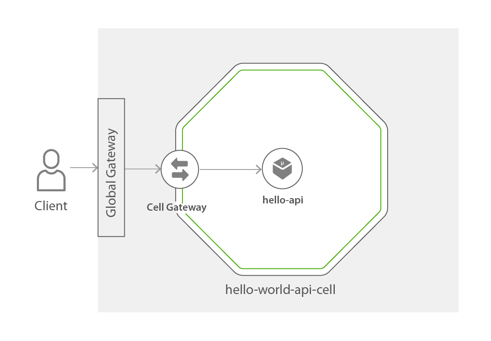
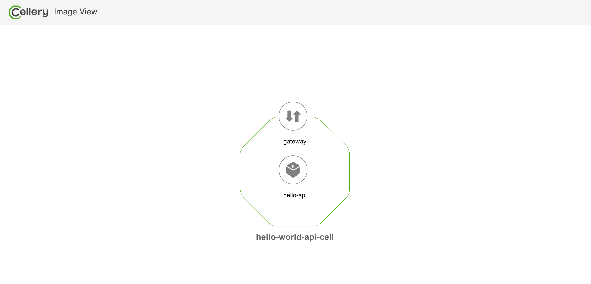

Hello world API cell
===============

Hello-world API sample is a simple rest API that returns the text 'Hello World!' as a response to a GET request.



##### Note: To run this sample, a cellery deployment which includes API Manager component is required (complete cellery deployment or basic celley deployment with APIM is required).

## Try hello world api sample

### 1. Checkout the Sample

1. Clone the [wso2-cellery/samples](https://github.com/wso2-cellery/samples) repository
2. Navigate to the hello-world-api Sample.
   ```
   cd <SAMPLES_ROOT>/cells/hello-world-api
   ```
### 2. Build and run hello world api cell
In this section let's focus on build, run and push a [hello world api cell](hello-world-api.bal). 

The cell `helloCell` consists of one component defined as `hello` component and it has one http API ingress that is exposed globally. 

```ballerina
import ballerina/io;
import celleryio/cellery;

public function build(cellery:ImageName iName) returns error? {
    //Hello World Component
    cellery:Component helloComponent = {
        name: "hello-api",
        src: {
            image: "docker.io/wso2cellery/samples-hello-world-api-service:latest-dev"
        },
        ingresses: {
            ingress: <cellery:HttpApiIngress>{
                port: 9090,
                context: "/hello",
                definition: {
                    resources: [
                        {
                            path: "/",
                            method: "GET"
                        }
                    ]
                },
                expose: "global"
            }
        }
    };

    cellery:CellImage helloCell = {
        components: {
            helloComp: helloComponent
        }
    };
    //Build Hello Cell
    io:println("Building Hello World Cell ...");
    return <@untainted> cellery:createImage(helloCell, iName);
}

public function run(cellery:ImageName iName, map<cellery:ImageName> instances, boolean startDependencies, boolean shareDependencies) returns (cellery:InstanceState[]|error?) {
    cellery:CellImage helloWorldApiCel = check cellery:constructCellImage(iName);
    return <@untainted> cellery:createInstance(helloWorldApiCel, iName, instances, startDependencies, shareDependencies);
}
```
---
#### Follow below instructions to build and run the hello world api cell.

1. Build the cellery image for hello world project by executing the cellery build command as shown below. Note `CELLERY_HUB_ORG` is your organization name in [cellery hub](https://hub.cellery.io/).
    ```
    $ cellery build hello-world-api.bal <CELLERY_HUB_ORG>/hello-world-api-cell:latest
    
    ✔ Building image <CELLERY_HUB_ORG>/hello-world-api-cell:latest
    ✔ Saving new Image to the Local Repository
    
    
    ✔ Successfully built cell image: <CELLERY_HUB_ORG>/hello-world-api-cell:latest
    
    What's next?
    --------------------------------------------------------
    Execute the following command to run the image:
      $ cellery run <CELLERY_HUB_ORG>/helloworld:latest
    --------------------------------------------------------
    ```

2. Run the cell image by executing `cellery run` command as shown below.
    ```
    $ cellery run <CELLERY_HUB_ORG>/hello-world-api-cell:latest -n hello-world-api-cell
       ✔ Extracting Cell Image  <CELLERY_HUB_ORG/hello-world-api-cell:latest
       
       Main Instance: my-hello-world
       
       ✔ Reading Cell Image  <CELLERY_HUB_ORG/hello-world-api-cell:latest
       ✔ Validating environment variables
       ✔ Validating dependencies
       
       Instances to be Used:
       
         INSTANCE NAME                     CELL IMAGE                         USED INSTANCE   SHARED
       ---------------------- --------------------------------------------- --------------- --------
        hello-world-api-cell    <CELLERY_HUB_ORG>/hello-world-api-cell:latest   To be Created    -
       
       Dependency Tree to be Used:
       
        No Dependencies
       
       ? Do you wish to continue with starting above Cell instances (Y/n)?
       
       ✔ Starting main instance my-hello-world
       
       
       ✔ Successfully deployed cell image:  <CELLERY_HUB_ORG>/hello-world-api-cell:latest
       
       What's next?
       --------------------------------------------------------
       Execute the following command to list running cells:
         $ cellery list instances
       --------------------------------------------------------
    ```
    
3. Now your hello world cell is deployed, you can run the cellery list instances command to see the status of the deployed cell.
    ```
    $ cellery list instances
                        INSTANCE                                   CELL IMAGE                   STATUS                            GATEWAY                               COMPONENTS           AGE
       ------------------------------------------ -------------------------------------------- -------- ----------------------------------------------------------------- ------------ ----------------------
        hello-world-api-cell           sinthuja/hello-world-api-cell:latest       Ready    sinthuja-hello-world-api-cell-latest-676b2131--gateway-service   1            10 minutes 1 seconds
    ```
4. Execute `cellery view` to see the components of your cell. This will open a HTML page in a browser and you can visualize the components and dependent cells of the cell image.
    ```
    $ cellery view <CELLERY_HUB_ORG>/hello-world-api-cell:latest
    ```
    
    
### 3. Obtain access token and invoke API

Since the hello-world-api is exposed via the global gateway, the request can go through the global API gateway to the hello world service. 
And, by default all the APIs are secured, therefore we need to obtain a token to invoke the API. The below provided steps explains the process to obtain the token and invoke the API.
Make sure you have configured the host entries correctly as mentioned in [local](https://github.com/wso2-cellery/sdk/blob/v0.3.0/docs/setup/local-setup.md), 
[gcp](https://github.com/wso2-cellery/sdk/blob/v0.3.0/docs/setup/gcp-setup.md#configure-host-entries) and [existing setup](https://github.com/wso2-cellery/sdk/blob/v0.3.0/docs/setup/existing-cluster.md#configure-host-entries) 
before proceeding to the following steps.
       
1. Login to the [API Store](https://wso2-apim/store/) as admin user (username: admin, password: admin).
    
2. Click on ‘hello_world_api_cell_global__hello’ to create a subscription and generate a token. 
(See  [Subscribing to an API](https://docs.wso2.com/display/AM260/Subscribe+to+an+API))
       
3. Once you have subscribed to the API and generated a token, invoke the API passing the same as a Bearer token:
   ```
   $ curl -H "Authorization: Bearer <token>" https://wso2-apim-gateway/hello-world-api-cell/hello/0.1 -k
   Hello World!
   ```

Congratulations! You have successfully tried out the hello world api sample! 

Please feel free to checkout this repository and play around with the sample as explained [here](../../src/hello-world-api)

## Did you try? 
1. [Hello world](../hello-world)

## What's Next? 
1. [Try pet store](../pet-store)
