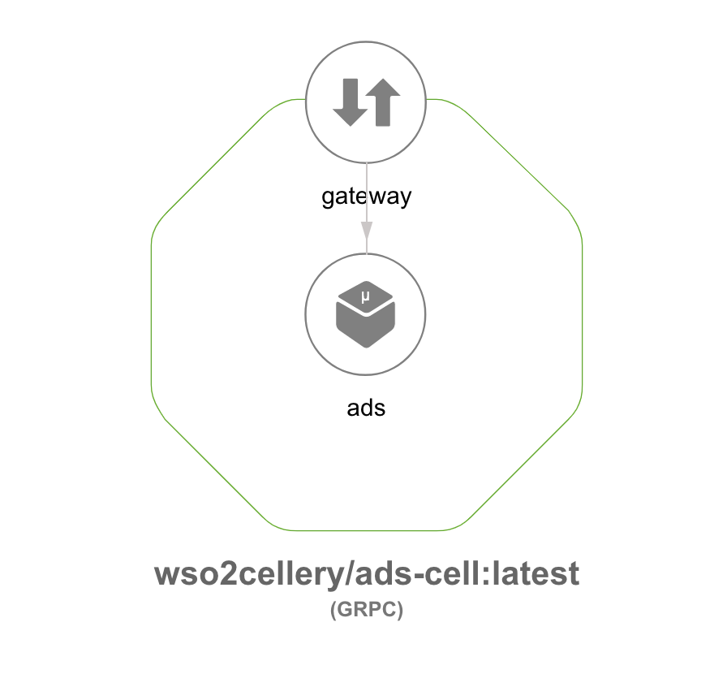
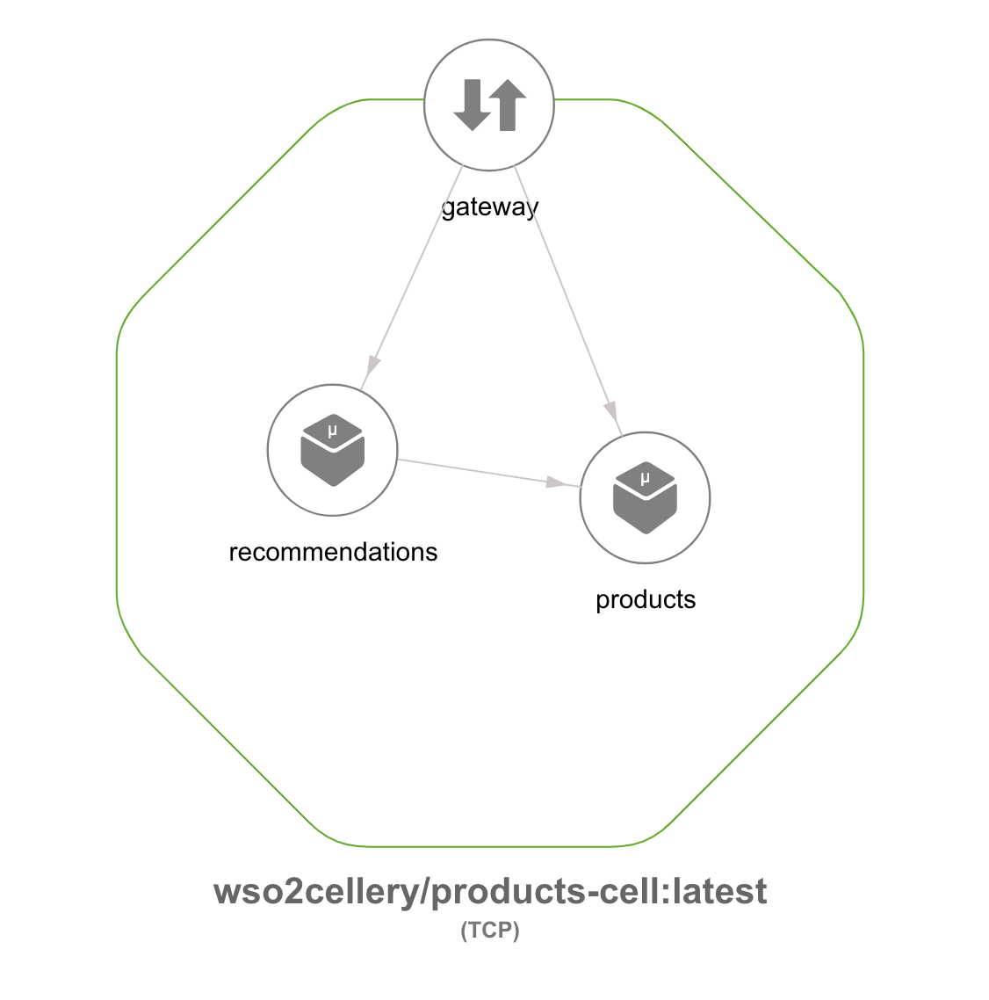
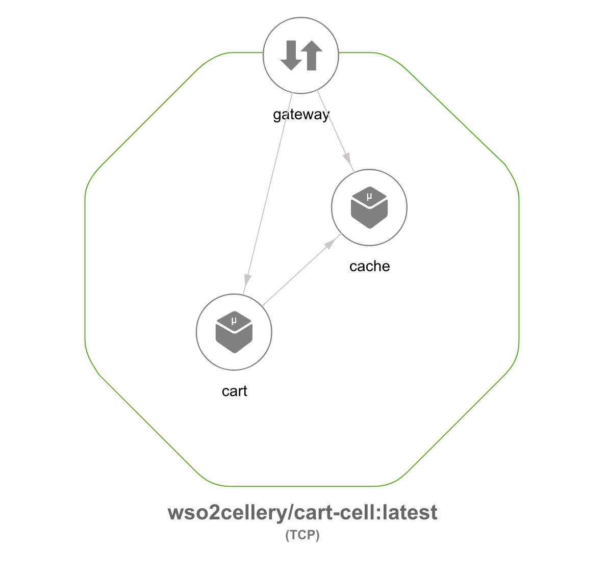
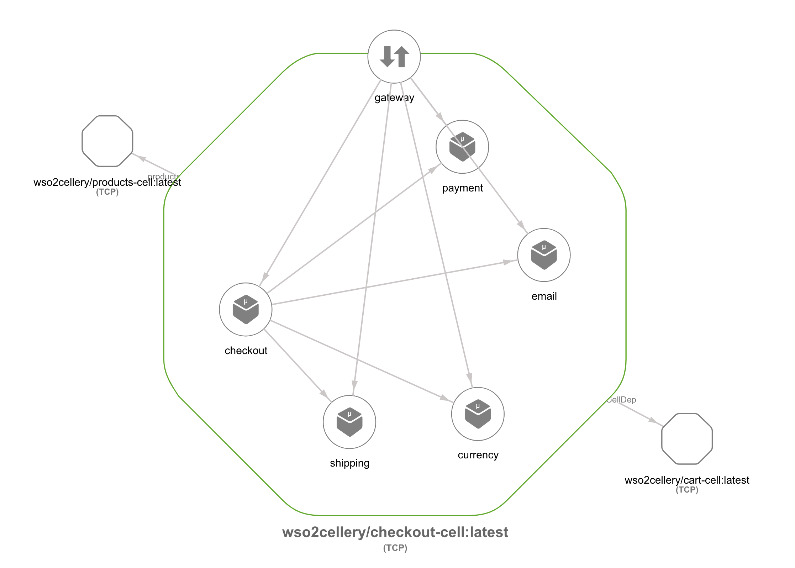
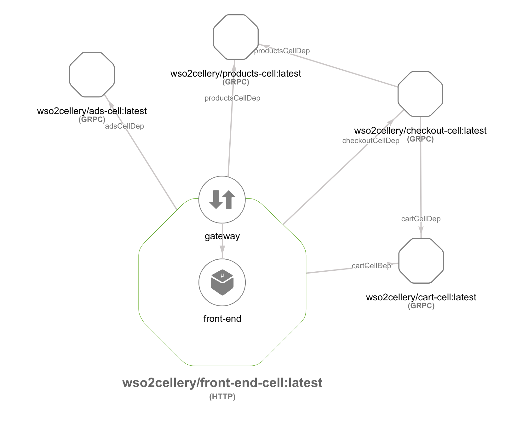

# Cell-Based Hipster Shop Application

All details of the original application, "Hipster Shop: Cloud-Native Microservices Demo Application" can be found [here](https://github.com/GoogleCloudPlatform/microservices-demo). 

The Hipster Shop project contains a 10-tier microservices application. The application is a
web-based e-commerce app called **“Hipster Shop”** where users can browse items,
add them to the cart, and purchase them.

## Screenshots

| Home Page                                                                                                         | Checkout Screen                                                                                                    |
| ----------------------------------------------------------------------------------------------------------------- | ------------------------------------------------------------------------------------------------------------------ |
| [](../../docs/images/hipster-shop/hipster-shop-frontend-1.png) | [](../../docs/images/hipster-shop/hipster-shop-frontend-2.png) |


| Checkout Cell                                                                                                         | Frontend Cell                                                                                                    |
| ----------------------------------------------------------------------------------------------------------------- | ------------------------------------------------------------------------------------------------------------------ |
| [](../../docs/images/hipster-shop/hipster-shop-checkout.png) | [](../../docs/images/hipster-shop/hipstershop-front-end.png) |


## Service Architecture

**Hipster Shop** is composed of many microservices written in different languages that talk to each other over gRPC.

[](../../docs/images/hipster-shop/architecture-diagram.png)

| Service                                              | Language      | Description                                                                                                                       |
| ---------------------------------------------------- | ------------- | --------------------------------------------------------------------------------------------------------------------------------- |
| [frontend](https://github.com/GoogleCloudPlatform/microservices-demo/tree/master/src/frontend)                           | Go            | Exposes an HTTP server to serve the website. Does not require signup/login and generates session IDs for all users automatically. |
| [cartservice](https://github.com/GoogleCloudPlatform/microservices-demo/tree/master/src/cartservice)                     | C#            | Stores the items in the user's shipping cart in Redis and retrieves it.                                                           |
| [productcatalogservice](https://github.com/GoogleCloudPlatform/microservices-demo/tree/master/src/productcatalogservice) | Go            | Provides the list of products from a JSON file and ability to search products and get individual products.                        |
| [currencyservice](https://github.com/GoogleCloudPlatform/microservices-demo/tree/master/src/currencyservice)             | Node.js       | Converts one money amount to another currency. Uses real values fetched from European Central Bank. It's the highest QPS service. |
| [paymentservice](https://github.com/GoogleCloudPlatform/microservices-demo/tree/master/src/paymentservice)               | Node.js       | Charges the given credit card info (mock) with the given amount and returns a transaction ID.                                     |
| [shippingservice](https://github.com/GoogleCloudPlatform/microservices-demo/tree/master/src/shippingservice)             | Go            | Gives shipping cost estimates based on the shopping cart. Ships items to the given address (mock)                                 |
| [emailservice](https://github.com/GoogleCloudPlatform/microservices-demo/tree/master/src/emailservice)                   | Python        | Sends users an order confirmation email (mock).                                                                                   |
| [checkoutservice](https://github.com/GoogleCloudPlatform/microservices-demo/tree/master/src/checkoutservice)             | Go            | Retrieves user cart, prepares order and orchestrates the payment, shipping and the email notification.                            |
| [recommendationservice](https://github.com/GoogleCloudPlatform/microservices-demo/tree/master/src/recommendationservice) | Python        | Recommends other products based on what's given in the cart.                                                                      |
| [adservice](https://github.com/GoogleCloudPlatform/microservices-demo/tree/master/src/adservice)                         | Java          | Provides text ads based on given context words.                                                                                   |
| [loadgenerator](https://github.com/GoogleCloudPlatform/microservices-demo/tree/master/src/loadgenerator)                 | Python/Locust | Continuously sends requests imitating realistic user shopping flows to the frontend.                                              |

## Cell Architecture

**Hipster Shop** is composed of many microservices written in different
languages that talk to each other over gRPC. This sample is structured into 5 cells: 
- [ads](ads)
- [products](products)
- [cart](cart)
- [checkout](checkout)
- [front-end](front-end)

[](../../docs/images/hipster-shop/hipstershop-cell-architecture.png)

## Quick Deploy the Hipster Shop Cells
Execute the command below to deploy the pre-built cell images in one go. If you are interested in building and running the cell images, execute the steps explained [here](#build-and-deploy-the-hipstershop-cells).

```
cellery run wso2cellery/front-end-cell:latest -n front-end-cell -l cartCellDep:cart-cell -l productsCellDep:products-cell -l adsCellDep:ads-cell -l checkoutCellDep:checkout-cell -d -y
```
Now [view the application](#viewing-the-application).

## Build and Deploy the Hipster Shop Cells
### 1. Clone sample
Clone the wso2-cellery/samples repository and 
navigate to the samples/cells/hipster-shop/directory.
```
cd samples/cells/hipster-shop
```

### 2. Build and run <b>ads</b> cell
```
$ cd ads/
$ cellery build ads.bal wso2cellery/ads-cell:latest  

✔ Building image wso2cellery/ads-cell:latest
✔ Removing old Image
✔ Saving new Image to the Local Repository


✔ Successfully built cell image: wso2cellery/ads-cell:latest

What's next?
--------------------------------------------------------
Execute the following command to run the image:
  $ cellery run wso2cellery/ads-cell:latest
--------------------------------------------------------
```

```
$ cellery run wso2cellery/ads-cell:latest -n ads-cell
✔ Extracting Cell Image wso2cellery/ads-cell:latest

Main Instance: ads-cell

✔ Reading Cell Image wso2cellery/ads-cell:latest
✔ Validating dependencies

Instances to be Used:

  INSTANCE NAME           CELL IMAGE            USED INSTANCE   SHARED  
 --------------- ----------------------------- --------------- -------- 
  ads-cell        wso2cellery/ads-cell:latest   To be Created    -      

Dependency Tree to be Used:

 No Dependencies

? Do you wish to continue with starting above Cell instances (Y/n)? y

✔ Starting main instance ads-cell


✔ Successfully deployed cell image: wso2cellery/ads-cell:latest

What's next?
--------------------------------------------------------
Execute the following command to list running cells:
  $ cellery list instances
--------------------------------------------------------
```

### 3. Build and run <b>products</b> cell
```
$ cd ../products/
$ cellery build products.bal wso2cellery/products-cell:latest

✔ Building image wso2cellery/products-cell:latest
✔ Removing old Image
✔ Saving new Image to the Local Repository


✔ Successfully built cell image: wso2cellery/products-cell:latest

What's next?
--------------------------------------------------------
Execute the following command to run the image:
  $ cellery run wso2cellery/products-cell:latest
--------------------------------------------------------
```

```
$ cellery run wso2cellery/products-cell:latest -n products-cell
✔ Extracting Cell Image wso2cellery/products-cell:latest

Main Instance: products-cell

✔ Reading Cell Image wso2cellery/products-cell:latest
✔ Validating dependencies

Instances to be Used:

  INSTANCE NAME              CELL IMAGE              USED INSTANCE   SHARED  
 --------------- ---------------------------------- --------------- -------- 
  products-cell   wso2cellery/products-cell:latest   To be Created    -      

Dependency Tree to be Used:

 No Dependencies

? Do you wish to continue with starting above Cell instances (Y/n)? y

✔ Starting main instance products-cell


✔ Successfully deployed cell image: wso2cellery/products-cell:latest

What's next?
--------------------------------------------------------
Execute the following command to list running cells:
  $ cellery list instances
--------------------------------------------------------
```

### 4. Build and run <b>cart</b> cell
```
$ cd ../cart/
$ cellery build cart.bal wso2cellery/cart-cell:latest
Warning: Value is empty for environment variable "CART_SERVICE_ADDR"

✔ Building image wso2cellery/cart-cell:latest
✔ Removing old Image
✔ Saving new Image to the Local Repository


✔ Successfully built cell image: wso2cellery/cart-cell:latest

What's next?
--------------------------------------------------------
Execute the following command to run the image:
  $ cellery run wso2cellery/cart-cell:latest
--------------------------------------------------------
```

```
$ cellery run wso2cellery/cart-cell:latest -n cart-cell
✔ Extracting Cell Image wso2cellery/cart-cell:latest

Main Instance: cart-cell

✔ Reading Cell Image wso2cellery/cart-cell:latest
✔ Validating dependencies

Instances to be Used:

  INSTANCE NAME            CELL IMAGE            USED INSTANCE   SHARED  
 --------------- ------------------------------ --------------- -------- 
  cart-cell       wso2cellery/cart-cell:latest   To be Created    -      

Dependency Tree to be Used:

 No Dependencies

? Do you wish to continue with starting above Cell instances (Y/n)? y

Warning: Value is empty for environment variable "CART_SERVICE_ADDR"
✔ Starting main instance cart-cell


✔ Successfully deployed cell image: wso2cellery/cart-cell:latest

What's next?
--------------------------------------------------------
Execute the following command to list running cells:
  $ cellery list instances
--------------------------------------------------------

```

### 5. Build and run <b>checkout</b> cell
```
$ cd ../checkout
$ cellery build checkout.bal wso2cellery/checkout-cell:latest

✔ Building image wso2cellery/checkout-cell:latest
✔ Removing old Image
✔ Saving new Image to the Local Repository


✔ Successfully built cell image: wso2cellery/checkout-cell:latest

What's next?
--------------------------------------------------------
Execute the following command to run the image:
  $ cellery run wso2cellery/checkout-cell:latest
--------------------------------------------------------
```

```
$ cellery run wso2cellery/checkout-cell:latest -n checkout-cell -l cartCellDep:cart-cell -l productsCellDep:products-cell -d
✔ Extracting Cell Image wso2cellery/checkout-cell:latest

Main Instance: checkout-cell

✔ Reading Cell Image wso2cellery/checkout-cell:latest
✔ Validating dependency links
✔ Generating dependency tree
✔ Validating dependency tree

Instances to be Used:

  INSTANCE NAME              CELL IMAGE                 USED INSTANCE       SHARED  
 --------------- ---------------------------------- ---------------------- -------- 
  cart-cell       wso2cellery/cart-cell:latest       Available in Runtime    -      
  products-cell   wso2cellery/products-cell:latest   Available in Runtime    -      
  checkout-cell   wso2cellery/checkout-cell:latest   To be Created           -      

Dependency Tree to be Used:

 checkout-cell
   ├── cartCellDep: cart-cell
   └── productsCellDep: products-cell

? Do you wish to continue with starting above Cell instances (Y/n)? y

✔ Starting dependencies
✔ Starting main instance checkout-cell


✔ Successfully deployed cell image: wso2cellery/checkout-cell:latest

What's next?
--------------------------------------------------------
Execute the following command to list running cells:
  $ cellery list instances
--------------------------------------------------------
```

### 6. Build and run <b>front-end</b> cell
```
$ cd ../front-end
$ cellery build front-end.bal wso2cellery/front-end-cell:latest

✔ Building image wso2cellery/front-end-cell:latest
✔ Removing old Image
✔ Saving new Image to the Local Repository


✔ Successfully built cell image: wso2cellery/front-end-cell:latest

What's next?
--------------------------------------------------------
Execute the following command to run the image:
  $ cellery run wso2cellery/front-end-cell:latest
--------------------------------------------------------
```

```
$ cellery run wso2cellery/front-end-cell:latest -n front-end-cell -l cartCellDep:cart-cell -l productsCellDep:products-cell -l adsCellDep:ads-cell -l checkoutCellDep:checkout-cell -d
✔ Extracting Cell Image wso2cellery/front-end-cell:latest

Main Instance: front-end-cell

✔ Reading Cell Image wso2cellery/front-end-cell:latest
⚠ Using a shared instance cart-cell for duplicated alias cartCellDep
⚠ Using a shared instance products-cell for duplicated alias productsCellDep
✔ Validating dependency links
✔ Generating dependency tree
✔ Validating dependency tree

Instances to be Used:

  INSTANCE NAME               CELL IMAGE                  USED INSTANCE       SHARED  
 ---------------- ----------------------------------- ---------------------- -------- 
  checkout-cell    wso2cellery/checkout-cell:latest    Available in Runtime    -      
  products-cell    wso2cellery/products-cell:latest    Available in Runtime   Shared  
  ads-cell         wso2cellery/ads-cell:latest         Available in Runtime    -      
  cart-cell        wso2cellery/cart-cell:latest        Available in Runtime   Shared  
  front-end-cell   wso2cellery/front-end-cell:latest   To be Created           -      

Dependency Tree to be Used:

 front-end-cell
   ├── checkoutCellDep: checkout-cell
   ├── productsCellDep: products-cell
   ├── adsCellDep: ads-cell
   └── cartCellDep: cart-cell

? Do you wish to continue with starting above Cell instances (Y/n)? y

✔ Starting dependencies
✔ Starting main instance front-end-cell


✔ Successfully deployed cell image: wso2cellery/front-end-cell:latest

What's next?
--------------------------------------------------------
Execute the following command to list running cells:
  $ cellery list instances
--------------------------------------------------------
```

### 7. Viewing the cells
Now all the application cells are deployed. Run the following command to see the status of the deployed cells.

```
$ cellery list instances
 INSTANCE                 CELL IMAGE               STATUS               GATEWAY               COMPONENTS            AGE           
 ---------------- ----------------------------------- -------- --------------------------------- ------------ ----------------------- 
  ads-cell         wso2cellery/ads-cell:latest         Ready    ads-cell--gateway-service         1            52 minutes 22 seconds  
  cart-cell        wso2cellery/cart-cell:latest        Ready    cart-cell--gateway-service        2            18 minutes 30 seconds  
  checkout-cell    wso2cellery/checkout-cell:latest    Ready    checkout-cell--gateway-service    5            11 minutes 10 seconds  
  front-end-cell   wso2cellery/front-end-cell:latest   Ready    front-end-cell--gateway-service   1            3 minutes 19 seconds   
  products-cell    wso2cellery/products-cell:latest    Ready    products-cell--gateway-service    2            26 minutes 55 seconds 
```

Run cellery view command to see the components of your cell. This will open a HTML page in a browser and you can visualize the components and the dependent cells of the cell.

```
$ cellery view wso2cellery/ads-cell:latest
```

[](../../docs/images/hipster-shop/ads-cell-view.png)

```
$ cellery view wso2cellery/products-cell:latest
```

[](../../docs/images/hipster-shop/products-cell-view.png)

```
$ cellery view wso2cellery/cart-cell:latest
```

[](../../docs/images/hipster-shop/cart-cell-view.png)

```
cellery view wso2cellery/checkout-cell:latest
```

[](../../docs/images/hipster-shop/checkout-cell-view.png)

```
cellery view wso2cellery/front-end-cell:latest
```

[](../../docs/images/hipster-shop/front-end-cell-view.png)


### 8. View the application
You would have already added the `/etc/host` entries during the cellery installation as mentioned in [local](https://github.com/wso2-cellery/sdk/blob/master/docs/setup/local-setup.md#configure-host-entries), 
[GCP](https://github.com/wso2-cellery/sdk/blob/master/docs/setup/gcp-setup.md#configure-host-entries) and
[existing kubernetes cluster](https://github.com/wso2-cellery/sdk/blob/master/docs/setup/existing-cluster.md#configure-host-entries). 
You will also need to add the entry `my-hipstershop.com` to the `/etc/host` file as shown below.

```
192.168.56.10 wso2-apim cellery-dashboard wso2sp-observability-api wso2-apim-gateway cellery-k8s-metrics idp.cellery-system pet-store.com hello-world.com my-hello-world.com my-hipstershop.com
```

Access url [http://my-hipstershop.com/](http://my-hipstershop.com/) from a browser and you can now try out the Hipster Shop application.

[](../../docs/images/hipster-shop/hipstershop-application.png)

[](../../docs/images/hipster-shop/hipstershop-application-cart.png)
