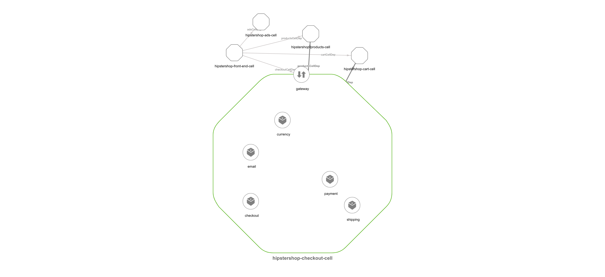
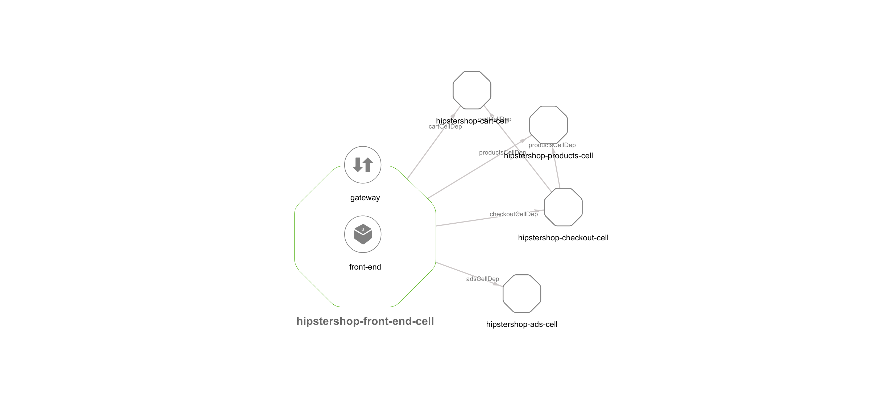
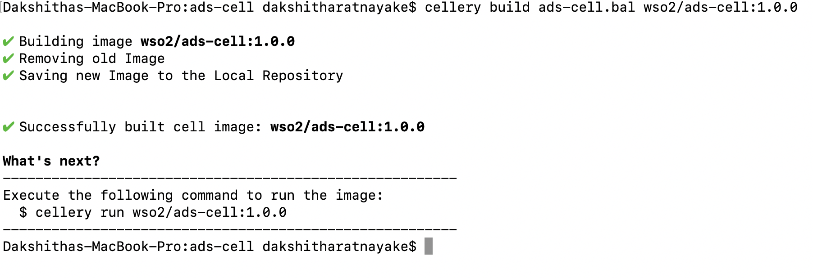
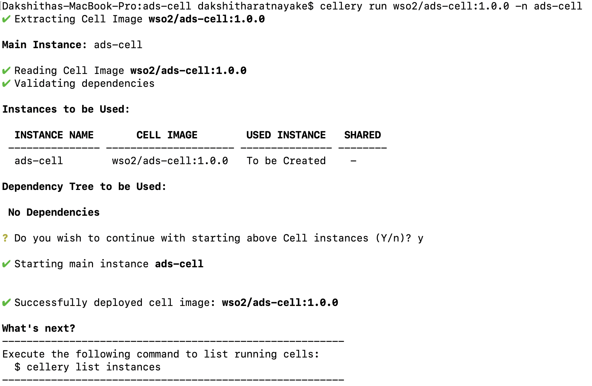
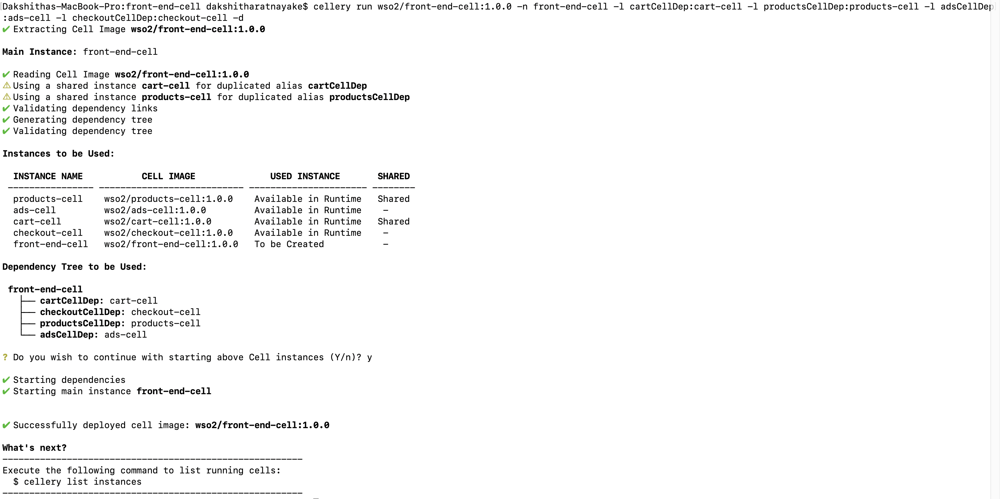
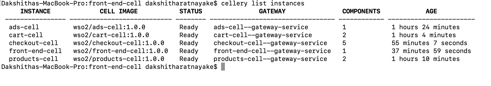
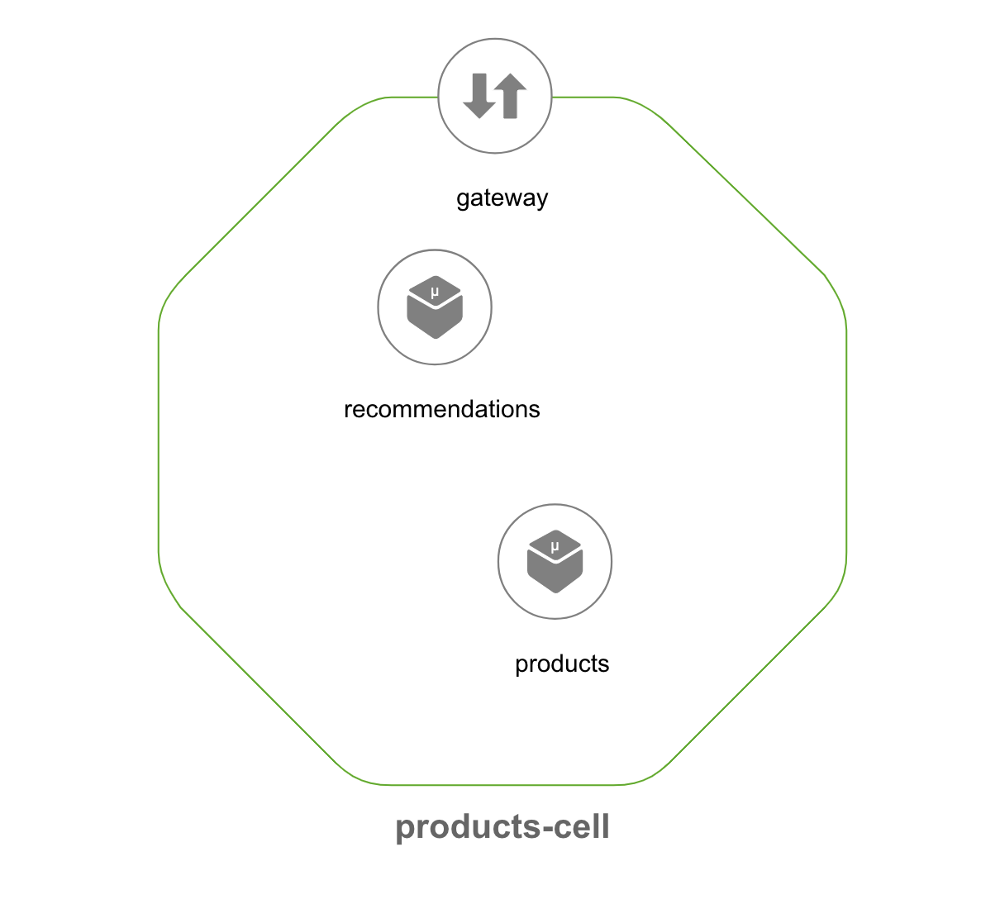
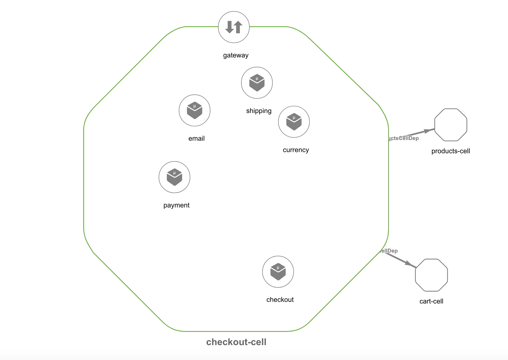

# Cell-based Hipster Shop Application

All details of the original Hipster Shop: Cloud-Native Microservices Demo Application can be found [here](https://github.com/GoogleCloudPlatform/microservices-demo). 

The Hipster Shop project contains a 10-tier microservices application. The application is a
web-based e-commerce app called **“Hipster Shop”** where users can browse items,
add them to the cart, and purchase them.

## Screenshots

| Home Page                                                                                                         | Checkout Screen                                                                                                    |
| ----------------------------------------------------------------------------------------------------------------- | ------------------------------------------------------------------------------------------------------------------ |
|  |  |

| Checkout Cell                                                                                                         | Frontend Cell                                                                                                    |
| ----------------------------------------------------------------------------------------------------------------- | ------------------------------------------------------------------------------------------------------------------ |
|  |  |

## Service Architecture

**Hipster Shop** is composed of many microservices written in different languages that talk to each other over gRPC.

| Service                                              | Language      | Description                                                                                                                       |
| ---------------------------------------------------- | ------------- | --------------------------------------------------------------------------------------------------------------------------------- |
| [frontend](https://github.com/GoogleCloudPlatform/microservices-demo/tree/master/src/frontend)                           | Go            | Exposes an HTTP server to serve the website. Does not require signup/login and generates session IDs for all users automatically. |
| [cartservice](https://github.com/GoogleCloudPlatform/microservices-demo/tree/master/src/cartservice)                     | C#            | Stores the items in the user's shipping cart in Redis and retrieves it.                                                           |
| [productcatalogservice](https://github.com/GoogleCloudPlatform/microservices-demo/tree/master/src/productcatalogservice) | Go            | Provides the list of products from a JSON file and ability to search products and get individual products.                        |
| [currencyservice](https://github.com/GoogleCloudPlatform/microservices-demo/tree/master/src/currencyservice)             | Node.js       | Converts one money amount to another currency. Uses real values fetched from European Central Bank. It's the highest QPS service. |
| [paymentservice](https://github.com/GoogleCloudPlatform/microservices-demo/tree/master/src/paymentservice)               | Node.js       | Charges the given credit card info (mock) with the given amount and returns a transaction ID.                                     |
| [shippingservice](https://github.com/GoogleCloudPlatform/microservices-demo/tree/master/src/shippingservice)             | Go            | Gives shipping cost estimates based on the shopping cart. Ships items to the given address (mock)                                 |
| [emailservice](https://github.com/GoogleCloudPlatform/microservices-demo/tree/master/src/emailservice)                   | Python        | Sends users an order confirmation email (mock).                                                                                   |
| [checkoutservice](https://github.com/GoogleCloudPlatform/microservices-demo/tree/master/src/checkoutservice)             | Go            | Retrieves user cart, prepares order and orchestrates the payment, shipping and the email notification.                            |
| [recommendationservice](https://github.com/GoogleCloudPlatform/microservices-demo/tree/master/src/recommendationservice) | Python        | Recommends other products based on what's given in the cart.                                                                      |
| [adservice](https://github.com/GoogleCloudPlatform/microservices-demo/tree/master/src/adservice)                         | Java          | Provides text ads based on given context words.                                                                                   |
| [loadgenerator](https://github.com/GoogleCloudPlatform/microservices-demo/tree/master/src/loadgenerator)                 | Python/Locust | Continuously sends requests imitating realistic user shopping flows to the frontend.                                              |

## Cell Architecture

**Hipster Shop** is composed of many microservices written in different
languages that talk to each other over gRPC. This sample is structured into 5 cells: 
- [ads-cell](ads)
- [products-cell](products)
- [cart-cell](cart)
- [checkout-cell](checkout)
- [front-end-cell](front-end)

## Build and Deploy the Hipstershop Cells
### Check Out Sample
Clone the hipstershop-cellery repository and 
navigate to the hipstershop-cellery sample.  
cd hipstershop-cellery/

Run the following command (required for cellery version 0.2.0 and if the setup is local) 
kubectl apply -f controller.yaml

### Build and Run <b>ads-cell</b>
cd hipstershop-cellery/ads-cell  
cellery build ads-cell.bal wso2/ads-cell:1.0.0  

cellery run wso2/ads-cell:1.0.0 -n ads-cell

### Build and Run <b>products-cell</b>
cd hipstershop-cellery/products-cell 
cellery build products-cell.bal wso2/products-cell:1.0.0

cellery run wso2/products-cell:1.0.0 -n products-cell

### Build and Run <b>cart-cell</b>
cd hipstershop-cellery/cart-cell 
cellery build cart-cell.bal wso2/cart-cell:1.0.0

cellery run wso2/cart-cell:1.0.0 -n cart-cell

### Build and Run <b>checkout-cell</b>
cd hipstershop-cellery/checkout-cell 
cellery build checkout-cell.bal wso2/checkout-cell:1.0.0

cellery run wso2/checkout-cell:1.0.0 -n checkout-cell -l cartCellDep:cart-cell -l productsCellDep:products-cell -d

### Build and Run <b>frontend-cell</b>
cd hipstershop-cellery/front-end-cell 
cellery build front-end-cell.bal wso2/front-end-cell:1.0.0

cellery run wso2/front-end-cell:1.0.0 -n front-end-cell -l cartCellDep:cart-cell -l productsCellDep:products-cell -l adsCellDep:ads-cell -l checkoutCellDep:checkout-cell -d

### Viewing the Cells

Now all the application cells are deployed. Run the following command to see the status of the deployed cells.

cellery list instances

Run cellery view command to see the components of your cell. This will open a HTML page in a browser and you can visualize the components and dependent cells of the cell image.

cellery view wso2/ads-cell:1.0.0

cellery view wso2/products-cell:1.0.0

cellery view wso2/cart-cell:1.0.0

cellery view wso2/checkout-cell:1.0.0

cellery view wso2/front-end-cell:1.0.0

### Viewing the Application
Add the following line to /etc/hosts file: 
127.0.0.1	my-hipstershop.com

Access url http://my-hipstershop.com/ from a browser.

