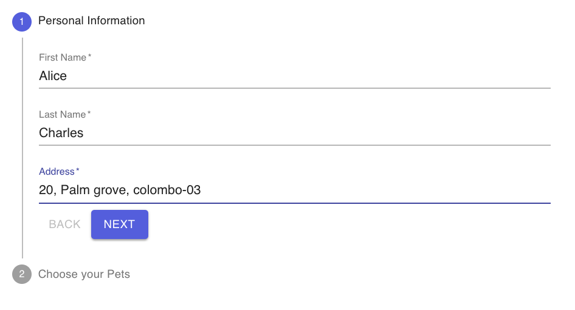
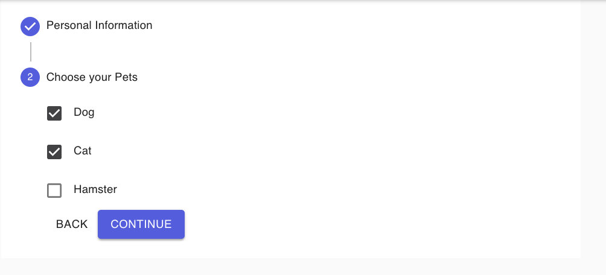
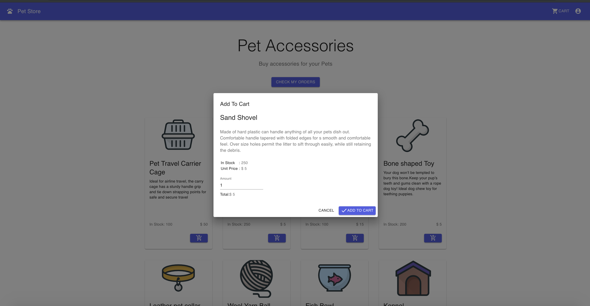
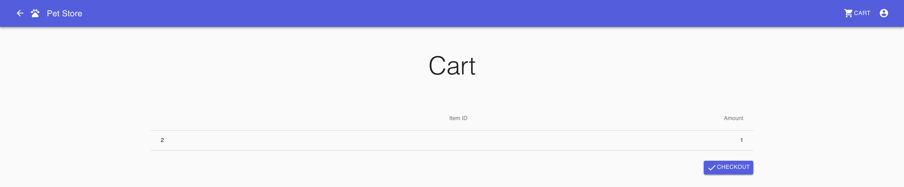
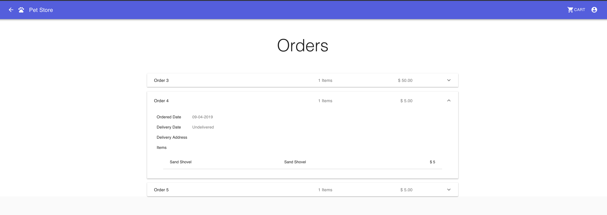

Pet Store
=========

Pet Store is a web portal which can be used by the customers for ordering accessories for their Pets.

This sample is a simple webapp which consists of 5 Docker images (4 microservices and a container to serve the web portal). 

* Catalog (Catalog of the accessories available in the pet store)
* Customers (Existing customers of the Pet Store)
* Orders (Orders placed at the Pet Store by Customers)
* Controller (Controller service which fetches data from the above 3 microservices and processes them to provide useful functionality)
* Portal (A simple Node JS container serving a React App with Server Side Rendering)

All 4 micro services are implemented in [node.js](https://nodejs.org/en/) and portal web application is a [React](https://reactjs.org/) application. 

This sample is structured into two Cells.

* [pet-be Cell](pet-be/README.md)
* [pet-fe Cell](pet-fe/README.md)


## [pet-be cell](pet-be/README.md)
This contains the four components which involves with working with the Petstore data and business logic Only catalog 
micro service exposed via cell pet-fe gateway which is used by pet-fe cell. Catalog, customer, and order micro services are not exposed outside the pet-be cell.

## [pet-fe cell](pet-fe/README.md)
This contains a single component `portal`, and it is exposed through a web cell which is able to provide SSO and web content delivery features.

This Pet store sample includes,

1. [Quick run](#quick-run)
2. [View application](#view-application)
3. [Build the cells by your own](#build-the-cells-by-your-own)
4. [Test cell](#run-cell-integration-tests)
4. [Observability](#observability)
5. [Update cell](#update-cell-with-new-version)
6. [Scale cell](#scale-cell)

## Quick run 
1. Pet store application can be started by executing the single command as shown below. For more details about flags 
refer [here](https://github.com/wso2-cellery/sdk/blob/master/docs/cli-reference.md#cellery-run).
```
 $ cellery run wso2cellery/pet-fe-cell:latest -n pet-fe -l petStoreBackend:pet-be -d
```
2. Executed `cellery list instances` and make sure pet-be and pet-fe cells are `Ready` as shown below.
```
  $ cellery list instances
  
  INSTANCE             CELL IMAGE             STATUS           GATEWAY           COMPONENTS           AGE
 ---------- -------------------------------- -------- ------------------------- ------------ ---------------------
  pet-be     wso2cellery/pet-be-cell:latest   Ready    pet-be--gateway-service   4            2 hours 47 minutes
  pet-fe     wso2cellery/pet-fe-cell:latest   Ready    pet-fe--gateway-service   1            3 hours 16 minutes
```
3. Now view the application by following the [instructions](#view-application).

## View application 
Make sure you have configured the host entries correctly as mentioned in [local](https://github.com/wso2-cellery/sdk/blob/master/docs/setup/local-setup.md), 
[gcp](https://github.com/wso2-cellery/sdk/blob/master/docs/setup/gcp-setup.md#configure-host-entries) and [existing setup](https://github.com/wso2-cellery/sdk/blob/master/docs/setup/existing-cluster.md#configure-host-entries) before
proceeding to following steps.

1. Access the petstore add via accessing [http://pet-store.com/](http://pet-store.com/). You will be landed in the home page of cellery. 
As `/` is configured to be as unsecured context as described [here](pet-fe/README.md), you can see the content of home page without logging in. 

2. Click on `sign in`, and you will be directed to the default IDP installed within cellery runtime. You can sign in as user alice (Username: alice, Password: alice123), 
and fill the customer information form. This operation will invoke the controller and customer micro-services from the pet store portal web application.





3. Once you logged in to the portal application, you can add items to the cart. And then click on the cart to checkout the items. This operation will invoke controller and catalog micro-services.





4. Return to the home page and click on the orders button which will show the orders placed by that user. 



5. You can logout from pet-store as alice user, and you can login as different user admin (Username: admin, Password:admin), and check for orders, which will 
return a empty orders as admin user hasn't placed any order. Therefore, you can realize the pet-store application user specific information.  

## [Build the cells by your own](../../docs/pet-store/build-and-run.md)
If you are interested getting in working more with Cellery, you can build and run the sample in your own. You can also make the changes to the 
cell files, or actual source of this sample and try out. Please follow the instructions provided [here](../../docs/pet-store/build-and-run.md) 
to build and run the pet store application. 

Checkout the application source of the [pet-fe](../../src/pet-store/pet-fe/portal) and [pet-be](../../src/pet-store/pet-be), 
and feel free to play around the source code.  Follow the instructions provided [here](../../src/pet-store) to build from source. 

## [Run cell integration tests](../../docs/pet-store/test-be-cell.md)
You can test the cell endpoints by running cell integration tests. Try running integration tests to validate the 
orders endpoint of the Petstore backend by following the instructions given [here](../../docs/pet-store/test-be-cell.md).

## [Observability](../../docs/pet-store/observability.md)
You can observe the pet-store application in runtime, and view cell overeview, request traces, metrics, dependency diagram and much more. 
Cellery observability mainly supported by [Cellery Dashboard](https://github.com/wso2-cellery/sdk/blob/master/docs/cellery-observability.md#use-cellery-dashboard). 
Please follow the instructions provided [here](../../docs/pet-store/observability.md) to use observability with pet-store. 

## [Update cell with new version](../../docs/pet-store/component-patch-and-adv-deployment.md)
In this section, we focus on how the cells can be updated in the runtime without having a considerable downtime. Cellery supports rolling updates, 
and advanced deployments such as blue-green and canary updates. In this sample, we provide step-by-step details on how to update a component of pet-be cell with the new 
version by rolling update, and update a new version of complete cell via blue-green and canary update. 
Please follow the instructions provided [here](../../docs/pet-store/component-patch-and-adv-deployment.md) to update the pet-be cell.

## [Scale cell](../../docs/pet-store/scale-cell.md)
In this section, we focus on attaching autoscaling policy and zero scaling policy to pet-be cell. We also use a load-gen 
cell to generate the load and test the functionality. Please follow the instructions [here](../../docs/pet-store/scale-cell.md) to get more detailed steps. 

# Did you try? 
1. [Hello world](../hello-world)
2. [Hello world Api](../hello-world-api)

# What's Next?
- [Hipster shop sample](../../cells/hipster-shop/README.md) - A sample that shows the cellery usage with the original 
micro services demo [here](https://github.com/GoogleCloudPlatform/microservices-demo).

