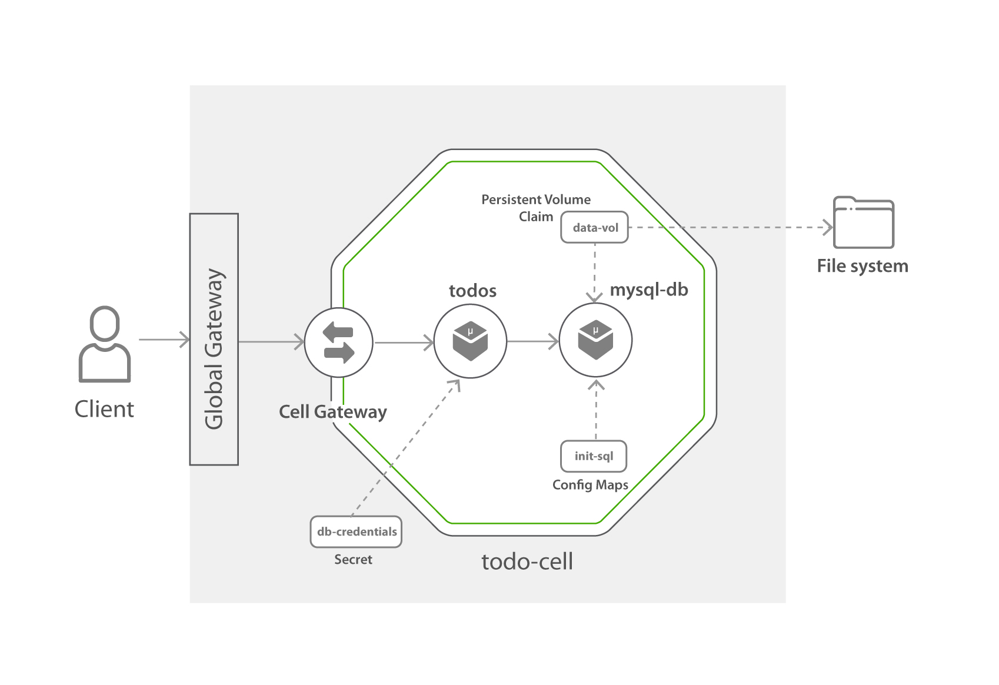
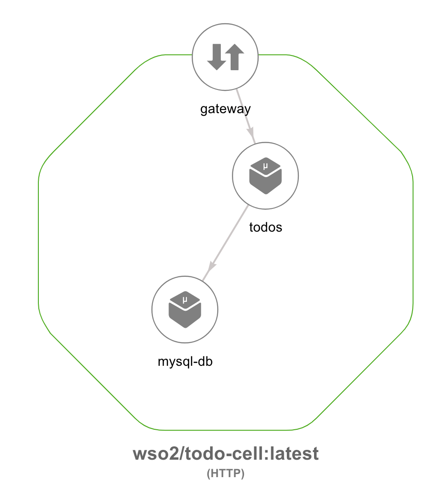

# TODO-Service Cell Advanced

The TODO Cell consists of a simple 'todo' micro service and mysql server. Todo micro service is written in go, and  this service
receives requests to add/list/update a todo items. These todo items are stored in mysql database.



Now let's look at the steps required to try this todo-cell.

## Try todo cell

### 1. Checkout the Sample

1. Clone the [wso2-cellery/samples](https://github.com/wso2-cellery/samples) repository
2. Navigate to the todo-service Sample.
   ```
   cd <SAMPLES_ROOT>/cells/todo-service/advanced
   ```

### 2. Build and run cell
In this section let's focus on build, run and push a [todo cell](todo-cell.bal). 

The `todo cell` contains two components `todo` and `mysql`. The `todo` component is defined by a container image `docker.io/wso2cellery/samples-todoapp-todos:latest` 
which is written in Go Lang and it is a simple micro service that add/list/update todo items by connecting to database. The `mysql` component is a MySQL database that is used to 
persists the todo items received by the `todo` component.

This example uses three types of volumes as described below.

   1. Configuration: `sqlconfig` configuration is used to mount the [init.sql](mysql/init.sql) script to mysql component.        
   2. Volume Claim: A persistence volume claim `volumeClaim` is mounted to `/var/lib/mysql` path of the mysql component to persist mysql data.
   3. Secret: The database credentials are mounted as a secret to `todoServiceComponet` in the path `/credentials`. 
   The secret is created at runtime using the environment variables `MYSQL_USERNAME` and `MYSQL_PASSWORD`.

```ballerina
// Cell file that wraps a todo micro service and mysql database.
import celleryio/cellery;
import ballerina/io;
import ballerina/config;

public function build(cellery:ImageName iName) returns error? {
    int mysqlPort = 3306;
    string mysqlPassword = "root";
    string mysqlScript = readFile("./mysql/init.sql");
    //Mysql database service which stores the todos that were added via the todos service
    cellery:Component mysqlComponent = {
        name: "mysql-db",
        src: {
            image: "library/mysql:8.0"
        },
        ingresses: {
            orders:  <cellery:TCPIngress>{
                    backendPort: mysqlPort
                }
        },
        envVars: {
            MYSQL_ROOT_PASSWORD: {
                value: "root"
            }
        },
        volumes: {
            sqlconfig: {
                path: "/docker-entrypoint-initdb.d",
                readOnly: false,
                volume:<cellery:NonSharedConfiguration>{
                     name:"init-sql",
                     data:{
                        "init.sql":mysqlScript
                     }
                }
            },
            volumeClaim: {
                path: "/var/lib/mysql",
                readOnly: false,
                volume:<cellery:K8sNonSharedPersistence>{
                     name:"data-vol",
                     storageClass:"local-storage",
                     accessMode: ["ReadWriteOnce"],
                     request:"1G"
                }
            }
        }
    };

    // This is the todos service which receives the to-do requests and connects
    // to database to persists the information.
    cellery:Component todoServiceComponent = {
        name: "todos",
        src: {
            image: "docker.io/wso2cellery/samples-todoapp-todos:latest-dev"
        },
        ingresses: {
            todo:  <cellery:HttpApiIngress>{
                   port: 8080,
                   context: "/todos",
                   definition:{
                       resources: [
                          {
                              path: "/",
                              method: "GET"
                          },
                          {   path: "/",
                              method: "POST"
                          },
                          {
                              path: "/*",
                              method: "GET"
                          },
                          {
                              path: "/*",
                              method: "PUT"
                          }
                       ]
                   },
                   expose:"global",
                   authenticate:false
               }
        },
        envVars: {
            PORT: {
                value: "8080"
            },
            DATABASE_HOST: {
                value: cellery:getHost(mysqlComponent)
            },
            DATABASE_PORT: {
                value: mysqlPort
            },
            DATABASE_NAME: {
                value: "todos_db"
            },
            DATABASE_CREDENTIALS_PATH: {
                value: "/credentials"
            }
        },
        volumes: {
            secret: {
                path: "/credentials",
                readOnly: false,
                volume:<cellery:SharedSecret>{
                    name:"db-credentials"
                }
            }
        },
        dependencies: {
            components: [mysqlComponent]
        }
    };

    // Cell Initialization
    cellery:CellImage cellImage = {
        components: {
            mysql: mysqlComponent,
            todoService: todoServiceComponent
        }
    };
    return <@untainted> cellery:createImage(cellImage,  iName);
}

public function run(cellery:ImageName iName, map<cellery:ImageName> instances, boolean startDependencies, boolean shareDependencies)
returns (cellery:InstanceState[] | error?) {
    string db_user = config:getAsString("MYSQL_USERNAME");
    string db_pwd = config:getAsString("MYSQL_PASSWORD");
    if (db_user == "" || db_pwd == "") {
            panic error("MYSQL_USERNAME or MYSQL_PASSWORD not found in environment");
    }
    cellery:NonSharedSecret mysqlCreds = {
        name: "db-credentials",
        data: {
            username: db_user,
            password: db_pwd
        }
    };
    error? e = cellery:createSecret(mysqlCreds);
    cellery:CellImage todoCell = check cellery:constructCellImage( iName);
    return <@untainted> cellery:createInstance(todoCell, iName, instances, startDependencies, shareDependencies);
}


function readFile(string filePath) returns (string) {
    io:ReadableByteChannel bchannel = <io:ReadableByteChannel> io:openReadableFile(filePath);
    io:ReadableCharacterChannel cChannel = new io:ReadableCharacterChannel(bchannel, "UTF-8");

    var readOutput = cChannel.read(5000);
    if (readOutput is string) {
        return <@untainted> readOutput;
    } else {
        return <@untainted> "Error: Unable to read file " + filePath;
    }
}
```
---

Follow below instructions to build, run and push the `todo` cell.

1. Create a volume according to your setup as described below. 
    
    #### Docker for mac
    1. Create a mysql folder in /tmp directory.
    ```bash
       $ mkdir -p /tmp/mysql
    ```
    2. Create the volume by deploying pv-docker-desktop.yaml
    ```bash
       $ kubectl create -f ../pv-docker-desktop.yaml
           storageclass.storage.k8s.io/local-storage created
           persistentvolume/mysql-pv-volume created
    ```
    
    #### Local Setup
    1. SSH in to kubernetes node. Enter the password as ```vagrant``` when prompted.
    ```bash
       $ ssh vagrant@192.168.56.10
       vagrant@192.168.56.10's password:
    ```       
    2. Create a mysql folder in /tmp directory.
    ```bash
       $ mkdir -p /tmp/mysql
    ```
    3. Create the volume by deploying pv-docker-desktop.yaml
    ```bash
       $ kubectl create -f ../pv-local.yaml
       storageclass.storage.k8s.io/local-storage created
       persistentvolume/mysql-pv-volume created
    ```
   
   #### GCP
    1. GCP has dynamic provisioning enabled by default. Therefore comment the `storageClass` from the `todo-cell.bal` file. 
    Final `volumeClaim` code segment in `mysql` component look like below.
    ```ballerina
       volumeClaim: {
           path: "/var/lib/mysql",
           readOnly: false,
           volume:<cellery:K8sNonSharedPersistence>{
                name:"data-vol",
                // storageClass:"local-storage", 
                accessMode: ["ReadWriteOnce"],
                request:"1G"
           }
       }  
    ``` 

2. After creating the persistence volume. Build the cell image for todo-cell project by executing the `cellery build` command as shown below.
 Note `CELLERY_HUB_ORG` is your organization name in [cellery hub](https://hub.cellery.io/).
    ```
    $ cellery build todo-cell-advanced.bal <CELLERY_HUB_ORG>/todo-cell-advanced:latest   
    
    ✔ Building image <CELLERY_HUB_ORG>/todo-cell-advanced:latest
    ✔ Saving new Image to the Local Repository
    
    
    ✔ Successfully built cell image: <CELLERY_HUB_ORG>/todo-cell-advanced:latest
    
    What's next?
    --------------------------------------------------------
    Execute the following command to run the image:
      $ cellery run <CELLERY_HUB_ORG>/todo-cell:latest
    --------------------------------------------------------
    ```    

3. Once the todo-cell is built,, you can run the cell and create the `todos` instance by below command. 
    ```
    $ cellery run wso2cellery/todo-cell-advanced:latest -n todos -e MYSQL_USERNAME=root -e MYSQL_PASSWORD=root                                                        
       ✔ Extracting Cell Image wso2cellery/todo-cell:latest
       ✔ Reading Image wso2cellery/todo-cell-advanced:latest
       Info: Main Instance: todos
       Info: Validating dependencies
       Info: Instances to be Used
       ------------------------------------------------------------------------------------------------------------------------
       INSTANCE NAME                  CELL IMAGE                          USED INSTANCE             KIND            SHARED
       ------------------------------------------------------------------------------------------------------------------------
       todos                          wso2cellery/todo-cell-advanced:latest   To be Created             cell       -
       ------------------------------------------------------------------------------------------------------------------------
       Info: Dependency Tree to be Used
       
       No Dependencies
       ✔ Starting main instance todos
       
       
       ✔ Successfully deployed cell image: wso2cellery/todo-cell-advanced:latest
       
       What's next?
       --------------------------------------------------------
       Execute the following command to list running cells:
         $ cellery list instances
       --------------------------------------------------------
    ```
    
4. Now todo-cell is deployed, execute `cellery list instances` to see the status of the deployed cell instance.
    ```
    $ cellery list instances
    
        cell Instances:
         INSTANCE                 IMAGE                 STATUS   COMPONENTS           AGE
        ---------- ----------------------------------- -------- ------------ ----------------------
         todos      wso2cellery/todo-cell-advanced:latest   Ready    2            1 minutes 40 seconds
    ```
    
5. Execute `cellery view` to see the components of the cell. This will open a webpage in a browser that allows to visualize the components of the cell image.
    ```
    $ cellery view <CELLERY_HUB_ORG>/todo-cell-advanced:latest
    ```
    
    
# 3. Invoke the cell application

The cell is published as an unsure API in the Global APIM.
Execute below steps to invoke `todo-api` in Global APIM.

   ```bash
   // Get the list of todo items
   $ curl https://wso2-apim-gateway/todos/todos/0.1/todos -k   
   [
     {
       "id": 1,
       "title": "Walk",
       "content": "Walk for 30 min around 6 PM",
       "done": false
     },
     {
       "id": 2,
       "title": "Pay Bills",
       "content": "Pay electricity and water bills",
       "done": false
     }
   ]
   
   // Add a new todo item
   $ curl -X POST https://wso2-apim-gateway/todos/todos/0.1/todos -k -d '{"title":"Coursework submission","content":"Submit the course work at 9:00p.m","done":false}'
   {
     "message": "successfully created"
   }
   
   // Get a todo item details
   $ curl https://wso2-apim-gateway/todos/todos/0.1/todos/3 -k  
     {
       "id": 3,
       "title": "Coursework submission",
       "content": "Submit the course work at 9:00p.m",
       "done": false
     }

   // Update a todo item
   $ curl -X PUT https://wso2-apim-gateway/todos/todos/0.1/todos/2 -k -d '{"title":"Pay Utility Bills","content":"Pay electricity, water and telephone bills","done":true}'
   {
     "message": "successfully updated"
   }
     
   ```

# 4. Push your cell  
As a final step, let's push your todo-cell [cellery hub](https://hub.cellery.io/) account as shown below.

```bash
    $ cellery push <CELLERY_HUB_ORG>/todo-cell-advanced:latest
    ✔ Connecting to registry-1.docker.io
    ✔ Reading image <CELLERY_HUB_ORG>/todo-cell-advanced:latest from the Local Repository
    ✔ Checking if the image <CELLERY_HUB_ORG>/todo-cell-advanced:latest already exists in the Registry
    ✔ Pushing image <CELLERY_HUB_ORG>/todo-cell-advanced:latest
    
    Image Digest : sha256:8935b3495a6c1cbc466ac28f4120c3836894e8ea1563fb5da7ecbd17e4b80df5
    
    ✔ Successfully pushed cell image: <CELLERY_HUB_ORG>/todo-cell-advanced:latest
    
    What's next?
    --------------------------------------------------------
    Execute the following command to pull the image:
      $ cellery pull <CELLERY_HUB_ORG>/todo-cell-advanced:latest
    --------------------------------------------------------
```

Congratulations! You have successfully created your own cell!

# 5. Clean up the setup.
1. As a final step, delete the cell and volume claim, secret and volume.
    ```bash
    $ cellery terminate todos
    $ kubectl delete secret db-credentials
    $ kubectl delete pvc todos--mysql-db-data-vol-pvc
    $ kubectl delete -f pv-local.yaml
    ``` 

## What's Next? 
1. [Try hello world Api](../hello-world-api)
2. [Try pet store](../pet-store)
