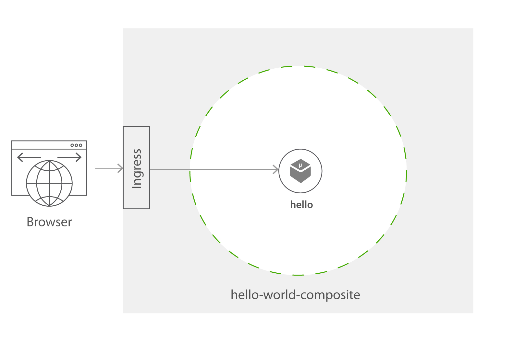
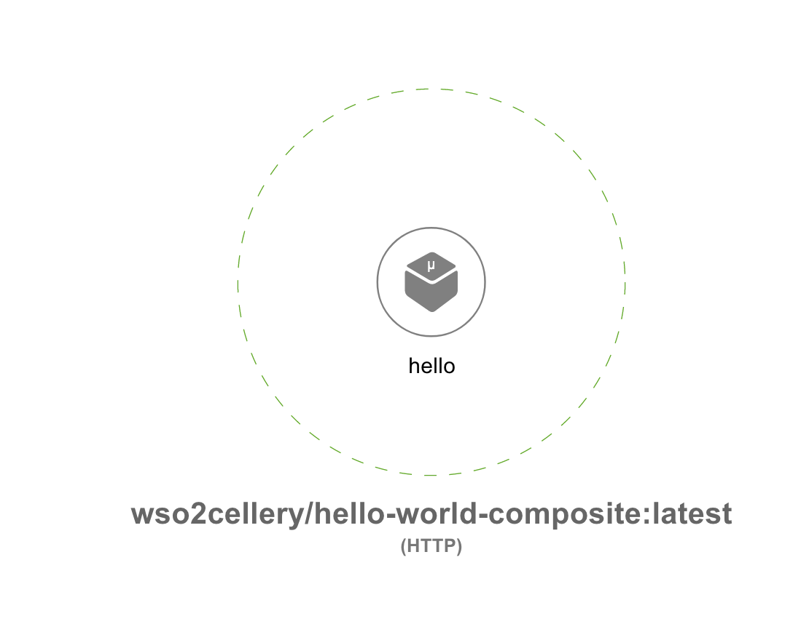

Hello world composite
=========

The hello-world composite contains one component hello. The hello component is defined by a container image which is written in Node.js and it is a simple webapp. 

Now let's look at the steps required to try this hello-world cell.



## Try hello world composite

### 1. Checkout the Sample

1. Clone the [wso2-cellery/samples](https://github.com/wso2-cellery/samples) repository
2. Navigate to the hello-world Sample.
   ```
   cd <SAMPLES_ROOT>/composite/hello-world
   ```

### 2. Build, run and push hello world composite
In this section let us focus on build, run and push a [hello-world composite](hello-world-composite.bal). 

The `helloComposite` contains one component `hello`. The hello component is defined by a container image `wso2cellery/samples-hello-world-webapp:latest-dev` 
which is written in Node.js and it is a simple webapp. An input variable `HELLO_NAME` is expected by the hello component with default value `Cellery` to render the webpage. 
These input parameters can be supplied when starting up the compositeto modify the runtime behaviour. 

```ballerina
import ballerina/config;
import celleryio/cellery;

public function build(cellery:ImageName iName) returns error? {
    // Hello Component
    // This Components exposes the HTML hello world page
    cellery:Component helloComponent = {
        name: "hello",
        src: {
            image: "wso2cellery/samples-hello-world-webapp:latest-dev"
        },
        ingresses: {
            webUI: <cellery:HttpPortIngress>{
                port: 80
            }
        },
        envVars: {
            HELLO_NAME: { value: "Cellery" }
        }
    };

    // Composite Initialization
    cellery:Composite helloComposite = {
        components: {
            helloComp: helloComponent
        }
    };
    return <@untainted> cellery:createImage(helloComposite,  iName);
}

public function run(cellery:ImageName iName, map<cellery:ImageName> instances, boolean startDependencies,
                    boolean shareDependencies) returns (cellery:InstanceState[]|error?) {
    cellery:Composite helloComposite = check cellery:constructImage( iName);
    string helloName = config:getAsString("HELLO_NAME");
    if (helloName !== "") {
        helloComposite.components["helloComp"]["envVars"]["HELLO_NAME"].value = helloName;
    }
    return <@untainted> cellery:createInstance(helloComposite, iName, instances, startDependencies, shareDependencies);
}
```
---

Follow below instructions to build, run and push the hello world composite.

1. Build the composite image for hello-world project by executing the `cellery build` command as shown below. Note `CELLERY_HUB_ORG` is your organization name in [cellery hub](https://hub.cellery.io/).
    ```
    $ cellery build hello-world-composite.bal <CELLERY_HUB_ORG>/hello-world-composite:latest
    Hello World Cell Built successfully.
    
    ✔ Building image <CELLERY_HUB_ORG>/hello-world-composite:latest
    ✔ Saving new Image to the Local Repository
    
    
    ✔ Successfully built image: <CELLERY_HUB_ORG>/hello-world-composite:latest
    
    What's next?
    --------------------------------------------------------
    Execute the following command to run the image:
      $ cellery run <CELLERY_HUB_ORG>/helloworld:latest
    --------------------------------------------------------
    ```

2. As mentioned above in the [hello-world.bal](hello-world-composite.bal), `HELLO_NAME` are used as input parameters to the `hello` component. 
Therefore, run the hello-world composite image with ‘cellery run’ command with input parameters your name for `HELLO_NAME` 
as shown below to change the hello-world components's default behaviour. 
    ```
    $ cellery run <CELLERY_HUB_ORG/hello-world-composite:latest -e HELLO_NAME=WSO2 -n hello
       ✔ Extracting Cell Image  <CELLERY_HUB_ORG/hello-world-composite:latest
       
       Main Instance: hello
       
       ✔ Reading Cell Image  <CELLERY_HUB_ORG/hello-world-composite:latest
       ✔ Validating environment variables
       ✔ Validating dependencies
       
       Instances to be Used:
       
         INSTANCE NAME              CELL IMAGE                               USED INSTANCE   SHARED
        ---------------- ----------------------------------------------- ------------------- --------
         hello           <CELLERY_HUB_ORG>/hello-world-composite:latest   To be Created         -
       
       Dependency Tree to be Used:
       
        No Dependencies
       
       ✔ Starting main instance my-hello-world
       
       
       ✔ Successfully deployed image:  <CELLERY_HUB_ORG>/hello-world-composite:latest
       
       What's next?
       --------------------------------------------------------
       Execute the following command to list running cells:
         $ cellery list instances
       --------------------------------------------------------
    ```
    
3. Now hello-world composite is deployed, execute `cellery list instances` to see the status of the deployed cell.
    ```
    $ cellery list instances
    
    Composite Instances:
      INSTANCE                    IMAGE                     STATUS   COMPONENTS            AGE
     ---------- ------------------------------------------ -------- ------------ -----------------------
      hello      wso2cellery/hello-world-composite:latest   Ready    1            10 minutes 45 seconds   
    ```
4. Execute `cellery view` to see the components of the cell. This will open a webpage in a browser that allows to visualize the components and dependent cells/components of the composite image.
    ```
    $ cellery view <CELLERY_HUB_ORG>/hello-world-composite:latest
    ```
    
    
5. Execute below command to create an ingress. Please note [this](https://raw.githubusercontent.com/wso2-cellery/samples/master/composites/hello-world/hello-world-ingress.yaml) 
   ingress is created to direct the traffic to kubernetes service `hello--hello-service` and this name is depends on the instance name of the composite (as we have started the composite instance as `hello`, 
   the service name will be `hello--hello-service`). Therefore, in case if you have started the composite instance with different name (e.g. `my-hello`), you will have to modify the ingress service name, 
   and create it accordingly (e.g. `my-hello--hello-service`).
   
    ```
    $ kubectl apply -f hello-world-ingress.yaml
    ```

6. Check the ingress rules are correctly applied by getting the list of ingresses as shown below.
    ```
    $ kubectl get ingress 
    NAME                HOSTS                       ADDRESS     PORTS   AGE
    hello-web-ingress   hello-world-composite.com   localhost   80      25m
    ```
       
7. Add the IP address shown in the ingress to your /etc/hosts, therefore you can invoke the service. 
     ```
     127.0.0.1 hello-world-composite.com
     ```
8. Now access the web page by accessing to [http://hello-world-composite.com]([http://hello-world-composite.com).
    
9. As a final step, let us push your first composite project to your [cellery hub](https://hub.cellery.io/) account as shown below.
    ```
    $ cellery push <CELLERY_HUB_ORG>/hello-world-composite:latest
    ✔ Connecting to registry-1.docker.io
    ✔ Reading image <CELLERY_HUB_ORG>/hello-world-composite:latest from the Local Repository
    ✔ Checking if the image <CELLERY_HUB_ORG>/hello-world-composite:latest already exists in the Registry
    ✔ Pushing image <CELLERY_HUB_ORG>/hello-world-composite:latest
    
    Image Digest : sha256:8935b3495a6c1cbc466ac28f4120c3836894e8ea1563fb5da7ecbd17e4b80df5
    
    ✔ Successfully pushed image: <CELLERY_HUB_ORG>/hello-world-composite:latest
    
    What's next?
    --------------------------------------------------------
    Execute the following command to pull the image:
      $ cellery pull <CELLERY_HUB_ORG>/hello-world-composite:latest
    --------------------------------------------------------
    ```
Congratulations! You have successfully created your own cell!
 
Please feel free to checkout this repository and play around with the sample as explained [here](../../src/hello-world)

## What's Next? 
1. [Todo service composite](../todo-service)
2. [Pet-store composite](../pet-store)
