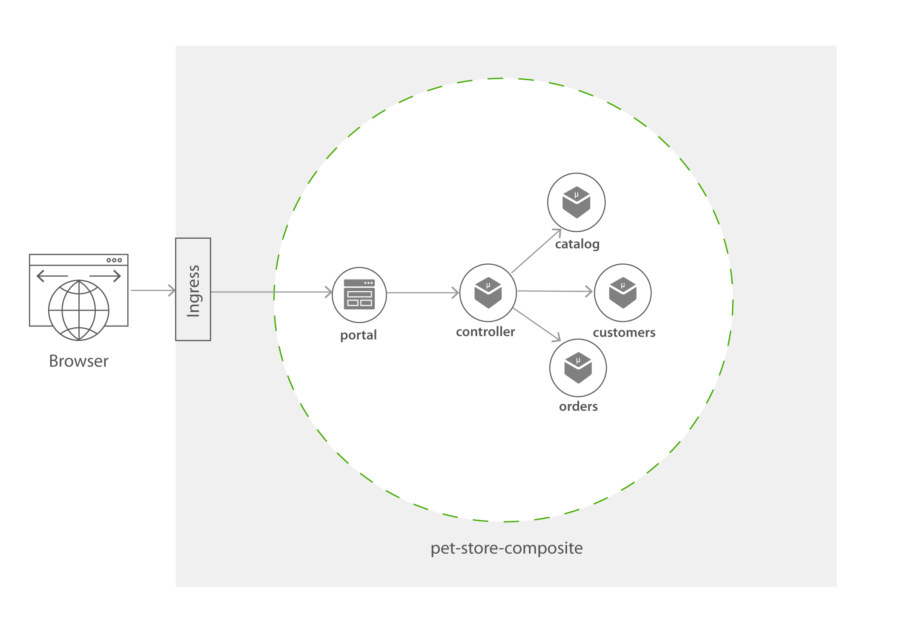
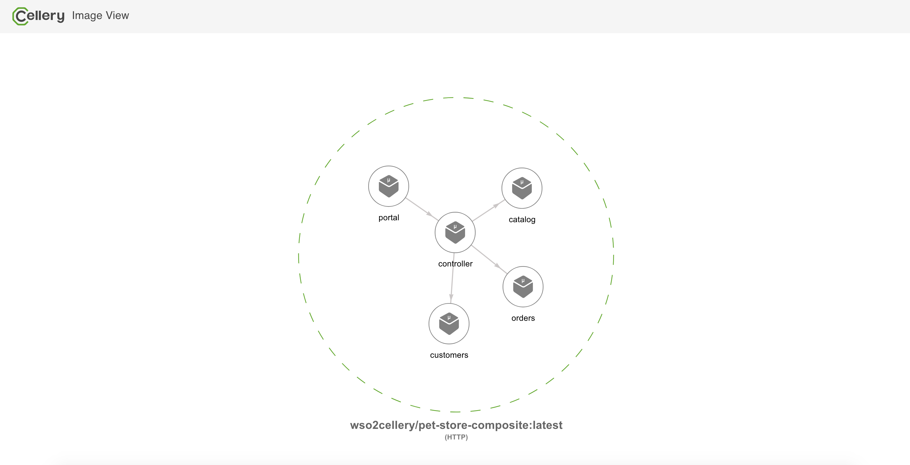
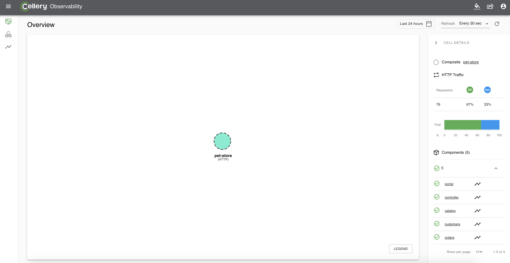
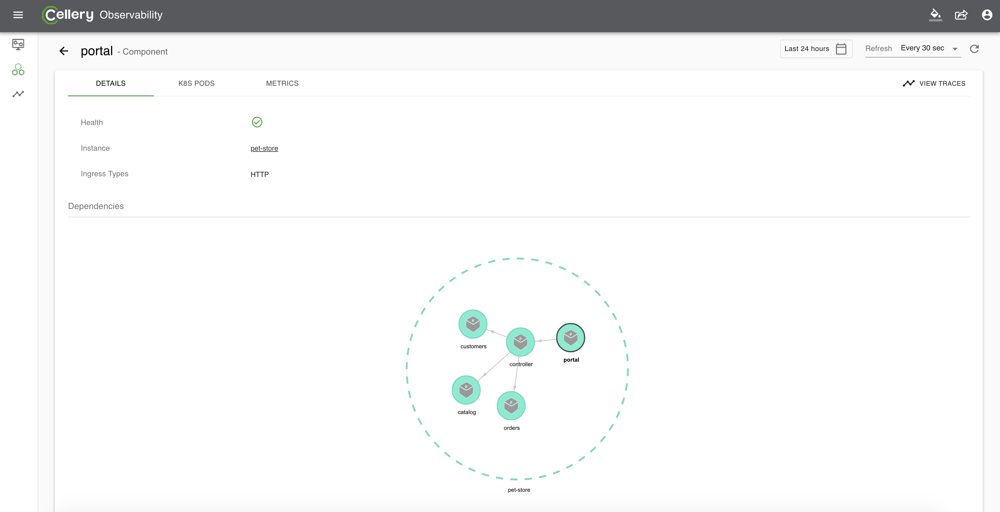
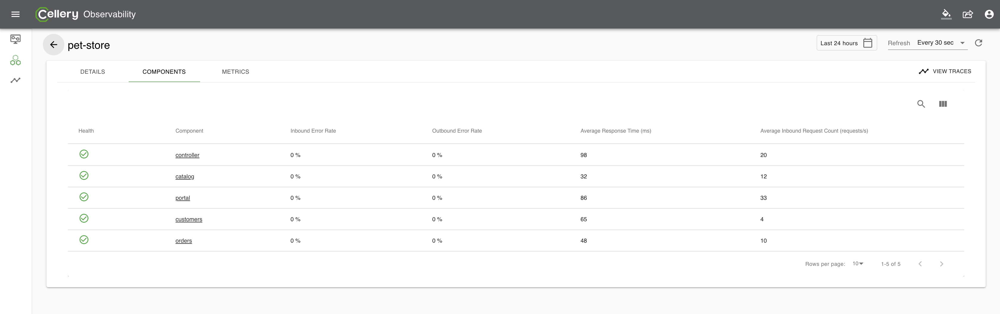
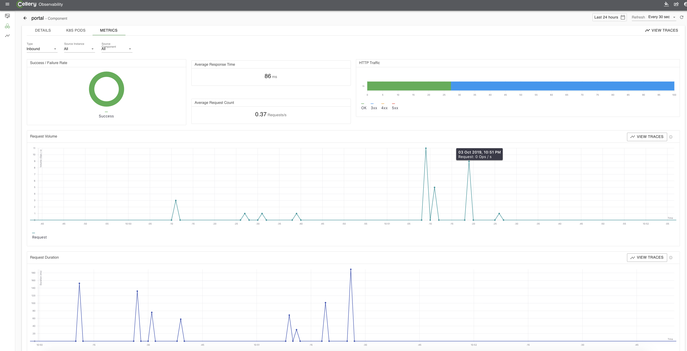
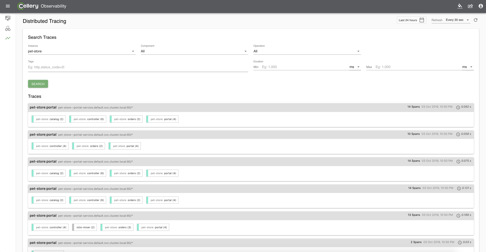
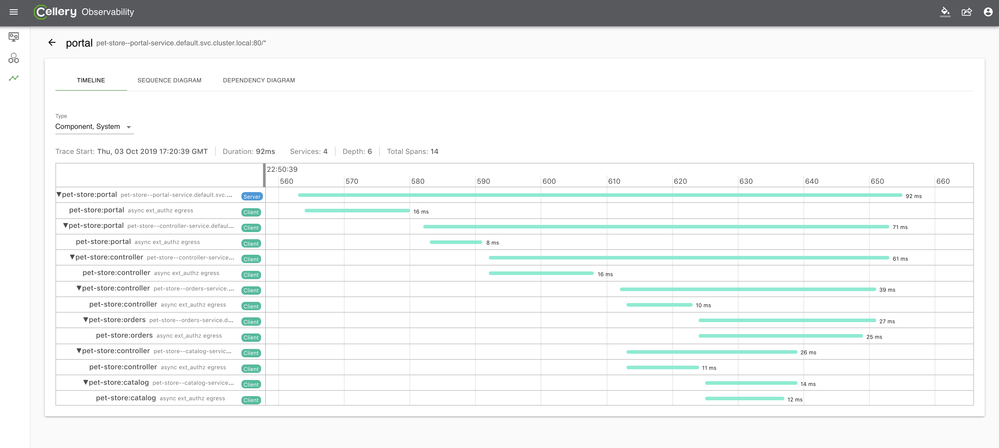
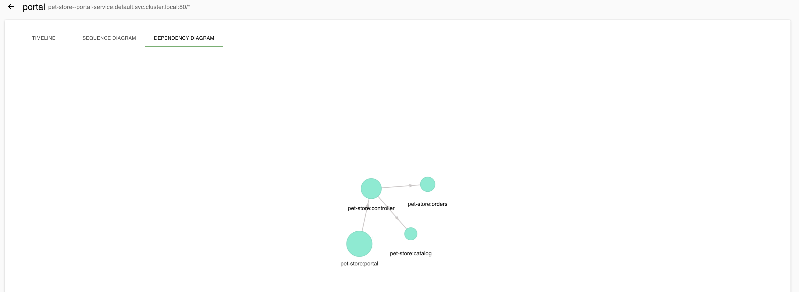

All-in-one Pet-store Composite
=========

This sample demonstrates how the components can be grouped together and installed as simple Composites. 

This sample is a simple webapp which consists of 5 Docker images (4 microservices and a container to serve the web portal). 

* Catalog (Catalog of the accessories available in the pet store)
* Customers (Existing customers of the Pet Store)
* Orders (Orders placed at the Pet Store by Customers)
* Controller (Controller service which fetches data from the above 3 microservices and processes them to provide useful functionality)
* Portal (A simple Node JS container serving a React App with Server Side Rendering)

All 4 micro services are implemented in [node.js](https://nodejs.org/en/) and portal web application is a [React](https://reactjs.org/) application. 

These all five components are included in a single Composite - [pet-store-composite.bal](pet-store-composite.bal) file. 
Composites are simply a group of components, and it do not have control over inter-communication between components. Further, unlike cells, 
composites do not have network boundary or cell gateway to control the incoming and traffic cells. 
Therefore, composites will not have default ingress rules or OIDC flow created as we have 
demonstrated in the [pet-store cells](../../cells/pet-store/pet-fe#build-method), which mandates the users to login to 
the pet-store applications. As the OIDC flow is not automatically performed with Composites, we have enabled the guest mode for this 
sample that allows users to by-pass the login flow and let them in as Guest. 



```ballerina
import celleryio/cellery;

public function build(cellery:ImageName iName) returns error? {

    string isGuestMode = "true";

    // Orders Component
    // This component deals with all the orders related functionality.
    int ordersPort = 80;
    cellery:Component ordersComponent = {
        name: "orders",
        src: {
            image: "wso2cellery/samples-pet-store-orders:latest-dev"
        },
        ingresses: {
            orders:  <cellery:HttpPortIngress>{
                port: ordersPort
            }
        },
        envVars: {
            GUEST_MODE_ENABLED: {value: isGuestMode}
        }
    };

    // Customers Component
    // This component deals with all the customers related functionality.
    int customerPort = 80;
    cellery:Component customersComponent = {
        name: "customers",
        src: {
            image: "wso2cellery/samples-pet-store-customers:latest-dev"
        },
        ingresses: {
            customers: <cellery:HttpPortIngress>{
                port: customerPort
            }
        },
        envVars: {
            GUEST_MODE_ENABLED: {value: isGuestMode}
        }
    };

    // Catalog Component
    // This component deals with all the catalog related functionality.
    int catalogPort = 80;
    cellery:Component catalogComponent = {
        name: "catalog",
        src: {
            image: "wso2cellery/samples-pet-store-catalog:latest-dev"
        },
        ingresses: {
            catalog: <cellery:HttpPortIngress>{
                port: catalogPort
            }
        },
        envVars: {
            GUEST_MODE_ENABLED: {value: isGuestMode}
        }
    };

    // Controller Component
    // This component deals depends on Orders, Customers and Catalog components.
    // This exposes useful functionality from the Cell by using the other three components.
    int controllerPort = 80;
    cellery:Component controllerComponent = {
        name: "controller",
        src: {
            image: "wso2cellery/samples-pet-store-controller:latest-dev"
        },
        ingresses: {
            ingress: <cellery:HttpPortIngress>{
                port: controllerPort
            }
        },
        envVars: {
            CATALOG_HOST: { value: cellery:getHost(catalogComponent) },
            CATALOG_PORT: { value: catalogPort },
            ORDER_HOST: { value: cellery:getHost(ordersComponent) },
            ORDER_PORT: { value: ordersPort },
            CUSTOMER_HOST: { value: cellery:getHost(customersComponent) },
            CUSTOMER_PORT: { value: customerPort },
            GUEST_MODE_ENABLED: {value: isGuestMode}
        },
        dependencies: {
            components: [catalogComponent, ordersComponent, customersComponent]
        }
    };

    cellery:Component portalComponent = {
            name: "portal",
            src: {
                image: "wso2cellery/samples-pet-store-portal:latest-dev"
            },
            ingresses: {
                portal: <cellery:HttpPortIngress>{
                    port: 80
              }
            },
            envVars: {
                PET_STORE_CELL_URL: { value: "http://"+cellery:getHost(controllerComponent)+":"+controllerPort.toString()},
                PORTAL_PORT: { value: 80 },
                BASE_PATH: { value: "." },
                GUEST_MODE_ENABLED: {value: isGuestMode}

            },
            dependencies: {
                components: [controllerComponent]
            }
        };

    // Composite Initialization
    cellery:Composite petstore = {
        components: {
            catalog: catalogComponent,
            customer: customersComponent,
            orders: ordersComponent,
            controller: controllerComponent,
            portal: portalComponent
        }
    };
    return <@untainted> cellery:createImage(petstore,  iName);
}

public function run(cellery:ImageName iName, map<cellery:ImageName> instances, boolean startDependencies, boolean shareDependencies)
       returns (cellery:InstanceState[]|error?) {
    cellery:Composite petStore = check cellery:constructImage( iName);
    return <@untainted> cellery:createInstance(petStore, iName, instances, startDependencies, shareDependencies);
}
```

Some important points to be noted in the Composite,
- The guest mode of the pet-store application is enabled with the Environment variable `GUEST_MODE_ENABLED`, to allow users to login as Guest.
- The components will be using `HttpPortIngress` which do not have APIs created in gateways.
- Instead of the `cellery:Cell` construct, all components are grouped as `cellery:Composite` and then passed into the createImage method. 

Now let us quick run or build and run the composites. And also observe the composites. 

1. [Quick Run](#quick-run)
2. [Create Ingress](#create-ingress)
3. [Access pet-store Composite](#access-the-pet-store-web-application)
4. [Build and Run the Composite](#build-and-run-the-pet-store-composite)
5. [Observe the Composite](#observability)

## Quick Run
1. Execute below command to pull the image from [Cellery Hub](https://hub.cellery.io/) and run. If you want to build and run the composite in your own, 
please go [here](#build-and-run-the-pet-store-composite).

```
$ cellery run wso2cellery/pet-store-composite:latest -n pet-store 
```
Now [create the ingress](#create-ingress) to access the pet-store application. 

## Create Ingress
1. You need to create the ingress to allow the external traffic to the pet-store application by below command. 
Please note [this](https://raw.githubusercontent.com/wso2-cellery/samples/master/composites/pet-store/all-in-one-composite/pet-store-ingress.yaml) 
ingress is created to direct the traffic to kubernetes service `pet-store--portal-service` and this name is depends on the instance name of the composite (as we have started the composite instance as `pet-store`, 
the service name will be `pet-store--portal-service`). Therefore, in case if you have started the composite instance with different name (e.g. `my-pet-store`), you will have to modify the ingress service name, 
and create it accordingly (e.g. `pet-store--portal-service`).
```
 $ kubectl apply -f https://raw.githubusercontent.com/wso2-cellery/samples/master/composites/pet-store/all-in-one-composite/pet-store-ingress.yaml
```
2. Check the ingress rules are correctly applied by getting the list of ingresses as shown below.
```
  $ kubectl get ingress 
  NAME                HOSTS                       ADDRESS     PORTS   AGE
  pet-store-ingress   pet-store-composite.com     localhost   80      78s
```
3. Add the IP address shown in the ingress to your /etc/hosts, therefore you can invoke the service. 
```
   127.0.0.1 pet-store-composite.com
```

Now you are all set, you can try to [access the pet-store application](#access-the-pet-store-web-application).

## Access the Pet-store web application
1. Go to [http://pet-store-composite.com/](http://pet-store-composite.com/) and view the application.


2. Sign-in As Guest and try out the application by purchasing some pet accessories. 

## Build and Run the Pet-store Composite
You can perform a [Quick Run](#quick-run) or build and run the pet-store composite in your own. Please perform below operations to be build your composite.

1. Clone the [wso2-cellery/samples](https://github.com/wso2-cellery/samples) repository.
2. Navigate to the pet-store composite sample.
   ```
   cd <SAMPLES_ROOT>/composites/pet-store/all-in-one-composite
   ```
1. Build the cell image for pet-store project by executing the `cellery build` command as shown below. Note `CELLERY_HUB_ORG` is your organization name in [Cellery hub](https://hub.cellery.io/).
    ```
    $ cellery build pet-store-composite.bal <CELLERY_HUB_ORG>/pet-store-composite:latest
    Hello World Cell Built successfully.
    
    ✔ Building image <CELLERY_HUB_ORG>/pet-store-composite:latest
    ✔ Saving new Image to the Local Repository
    
    
    ✔ Successfully built cell image: <CELLERY_HUB_ORG>/pet-store-composite:latest
    
    What's next?
    --------------------------------------------------------
    Execute the following command to run the image:
      $ cellery run <CELLERY_HUB_ORG>/pet-store-composite:latest
    --------------------------------------------------------
    ```

2. Once the pet-store is built, you can run the composite and create the `pet-store` instance by below command. 
    ```
    $ cellery run wso2cellery/pet-store-composite:latest -n pet-store
       ✔ Extracting Cell Image wso2cellery/pet-store-composite:latest
       ✔ Reading Image wso2cellery/pet-store-composite:latest
       Info: Main Instance: pet-store
       Info: Validating dependencies
       Info: Instances to be Used
       ------------------------------------------------------------------------------------------------------------------------
       INSTANCE NAME                  CELL IMAGE                                   USED INSTANCE             KIND            SHARED
       ------------------------------------------------------------------------------------------------------------------------
       pet-store                     wso2cellery/pet-store-composite:latest        To be Created             Composite       -
       ------------------------------------------------------------------------------------------------------------------------
       Info: Dependency Tree to be Used
       
       No Dependencies
       ✔ Starting main instance pet-store
       
       
       ✔ Successfully deployed cell image: wso2cellery/pet-store-composite:latest
       
       What's next?
       --------------------------------------------------------
       Execute the following command to list running cells:
         $ cellery list instances
       --------------------------------------------------------
    ```
    
3. Now pet-store is deployed, execute `cellery list instances` to see the status of the deployed composite instance.
    ```
    $ cellery list instances
    
        Composite Instances:
         INSTANCE                 IMAGE                 STATUS   COMPONENTS           AGE
        ---------- ----------------------------------- -------- ------------ ----------------------
         pet-store      wso2cellery/pet-store-composite:latest   Ready    5            1 minutes 40 seconds
    ```
    
4. Execute `cellery view` to see the components of the composite. This will open a webpage in a browser that allows to visualize the components of the composite image.
    ```
    $ cellery view <CELLERY_HUB_ORG>/pet-store-composite:latest
    ```
    

Now proceed to [Create Ingress](#create-ingress) to allow the access to the pet-store application, and then [access the application](#access-the-pet-store-web-application).

## Observability
Similar to Cells, the Composites can also be observed. You can login to the [Cellery Dashboard](http://cellery-dashboard) to see the observability.

*Note:*
In order to see the observability data, you require have observability enabled. Therefore perform below steps to confirm observability 
is enabled and enable it if it is not already performed.

1. Execute `cellery setup status` command as shown below.
```
$ cellery setup status
cluster name: docker-desktop

       SYSTEM COMPONENT         STATUS
 ---------------------------- ----------
  ApiManager                   Enabled
  Observability                Enabled
  Scale to zero                Disabled
  Horizontal pod auto scalar   Disabled
``` 

2. If observability is already disabled, then you require to enable the observability as shown below. Please find more information about modify command [here](https://github.com/wso2-cellery/sdk/blob/master/docs/setup/modify-setup.md).

```
$ cellery setup modify --observability=enable
``` 

Follow below steps to try out the [Cellery Dashboard](http://cellery-dashboard)

1. Login to cellery dashboard with username: admin and password: admin.
2. Overview page with pet-store composite and overall metrics, health, and component details.

3. By clicking a component from main overview page, you will be able tp see the component overview.

4. Component listing will provide metrics summary, and you can also get detailed metrics view over time as shown below.


5. Distributed search can be performed, and each request can be visualized in timeline view, sequence diagram view and metrics view.
 



# What's Next?
- [Composite to Composite pet-store](../composite-to-composite) - This will demonstrate how we can split the all-in-one composite into two composites and deploy into the runtime.
- [Cell to Composite pet-store](../cell-to-composite) - This will demonstrate how cells and composites can be deployed together and interacted in a runtime.
