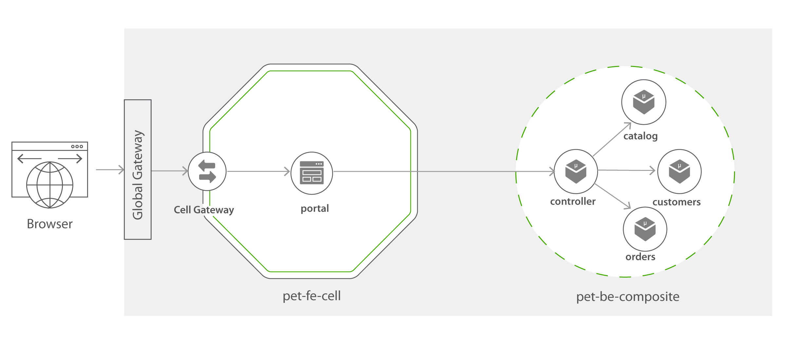
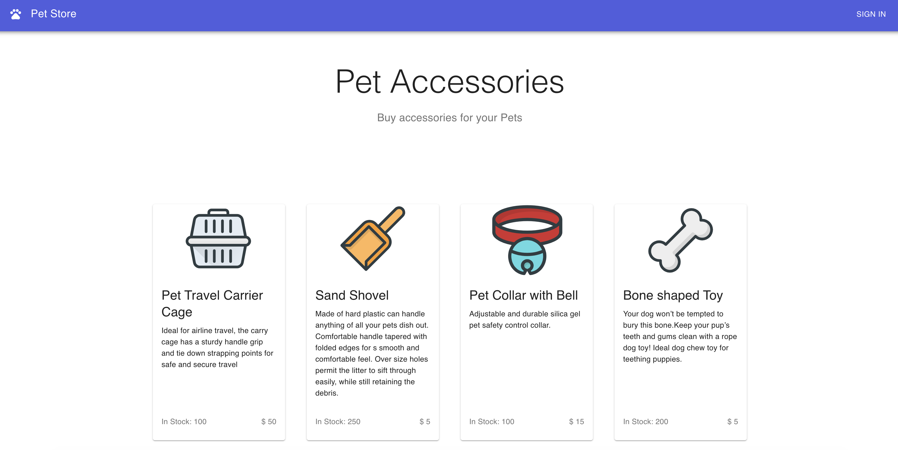
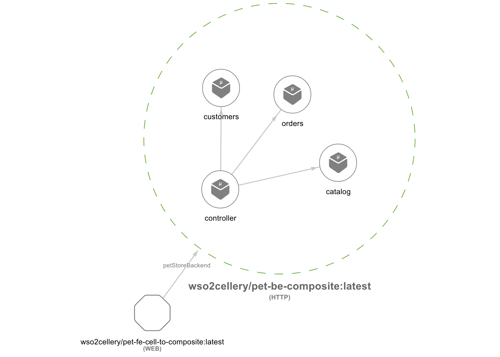

Cell to Composite in Pet-store
=========

This sample demonstrates how the components can be grouped together and installed as simple Composites. 

This sample is a simple webapp which consists of 5 Docker images (4 microservices and a container to serve the web portal). 

* Catalog (Catalog of the accessories available in the pet store)
* Customers (Existing customers of the Pet Store)
* Orders (Orders placed at the Pet Store by Customers)
* Controller (Controller service which fetches data from the above 3 microservices and processes them to provide useful functionality)
* Portal (A simple Node JS container serving a React App with Server Side Rendering)

All 4 micro services are implemented in [node.js](https://nodejs.org/en/) and portal web application is a [React](https://reactjs.org/) application. 

All four backedn components (Catalog, Customers, Orders, and Controller) are included in a backend Composite - [pet-be-composite.bal](pet-be-composite.bal) file, a
and front end component (Portal) is wrapped as cell - [pet-fe-cell-to-composite.bal](pet-fe-cell-to-composite.bal). Therefore, the cell gateway 
in the frontend cell can enable OIDC flow, unlike composites [all-in-composite](../all-in-one-composite) or [composite-composite](../cell-to-composite) samples.

Let us focus on the [pet-fe-cell-to-composite.bal](pet-fe-cell-to-composite.bal), which uses composite reference to link to pet-be-composite.



```ballerina
import celleryio/cellery;
import ballerina/config;

public function build(cellery:ImageName iName) returns error? {
    // Portal Component
    // This is the Component which exposes the Pet Store portal
    cellery:Component portalComponent = {
        name: "portal",
        source: {
            image: "wso2cellery/samples-pet-store-portal:latest"
        },
        ingresses: {
            portal: <cellery:WebIngress>{ // Web ingress will be always exposed globally.
                port: 80,
                gatewayConfig: {
                    vhost: "pet-store.com",
                    context: "/",
                    oidc: {
                        nonSecurePaths: ["/", "/app/*"],
                        providerUrl: "",
                        clientId: "",
                        clientSecret: {
                            dcrUser: "",
                            dcrPassword: ""
                        },
                        redirectUrl: "http://pet-store.com/_auth/callback",
                        baseUrl: "http://pet-store.com/",
                        subjectClaim: "given_name"
                    }
                }
            }
        },
        envVars: {
            PET_STORE_CELL_URL: { value: "" },
            PORTAL_PORT: { value: 80 },
            BASE_PATH: { value: "." }
        },
        dependencies: {
            composites: {
                petStoreBackend: <cellery:ImageName>{ org: "wso2cellery", name: "pet-be-composite", ver: "latest" }
            }
        }
    };

    // Assign the URL of the backend cell
   cellery:Reference petStoreBackend = cellery:getReference(portalComponent, "petStoreBackend");
   portalComponent.envVars.PET_STORE_CELL_URL.value =
   "http://" +<string>petStoreBackend.controller_host + ":" + <string>petStoreBackend.controller_port;

    // Cell Initialization
    cellery:CellImage petStoreFrontendCell = {
        components: {
            portal: portalComponent
        }
    };
    return cellery:createImage(petStoreFrontendCell, untaint iName);
}

...

```

Some important points to be noted in the above Cell,
- Dependencies section includes `wso2cellery/pet-be-composite` composite image.
- The actual endpoint of the composite is resolved via loading the cellery:Reference of the `petStoreBackend` dependency alias.

Now let us quick run or build and run the composites. And also observe the composites. 

1. [Quick Run](#quick-run)
2. [Access pet-store Composite](#access-the-pet-store-web-application)
3. [Build and Run the Composite](#build-and-run-the-composite)
4. [Observe the Composite](#observability)

## Quick Run
1. Execute below command to pull the image from [Cellery Hub](https://hub.cellery.io/) and run. If you want to build and run the composite in your own, 
please go [here](#build-and-run-the-composite).

```
$ cellery run wso2cellery/pet-fe-cell-to-composite:latest -n pet-fe-comp-cell -l petStoreBackend:pet-be-comp -d
```
Now you can [access the pet-store application](#access-the-pet-store-web-application). 

## Access the Pet-store web application
1. Go to [http://pet-store.com/](http://pet-store.com/) and view the application.


2. Sign-in as default user (Username: admin, Password: admin) and try out the application by purchasing some pet accessories. . 

## Build and Run the Composite
You can perform a [Quick Run](#quick-run) or build and run the pet-store composite in your own. Please perform below operations to be build your composite.

1. Clone the [wso2-cellery/samples](https://github.com/wso2-cellery/samples) repository.
2. Navigate to the pet-store composite sample.
   ```
   cd <SAMPLES_ROOT>/composites/pet-store/cell-to-composite
   ```
1. Build the cell image for pet-store project by executing the `cellery build` command as shown below. Note `CELLERY_HUB_ORG` is your organization name in [Cellery hub](https://hub.cellery.io/).
    ```
    $ cellery build pet-be-composite.bal <CELLERY_HUB_ORG>/pet-be-composite:latest
    Hello World Cell Built successfully.
    
    ✔ Building image <CELLERY_HUB_ORG>/pet-be-composite:latest
    ✔ Saving new Image to the Local Repository
    
    
    ✔ Successfully built cell image: <CELLERY_HUB_ORG>/pet-be-composite:latest
    
    What's next?
    --------------------------------------------------------
    Execute the following command to run the image:
      $ cellery run <CELLERY_HUB_ORG>/pet-be-composite:latest
    --------------------------------------------------------

    $ cellery build pet-fe-cell-to-composite.bal <CELLERY_HUB_ORG>/pet-fe-cell-to-composite:latest
    Hello World Cell Built successfully.
    
    ✔ Building image <CELLERY_HUB_ORG>/pet-fe-cell-to-composite:latest
    ✔ Saving new Image to the Local Repository
    
    
    ✔ Successfully built cell image: <CELLERY_HUB_ORG>/pet-fe-cell-to-composite:latest
    
    What's next?
    --------------------------------------------------------
    Execute the following command to run the image:
      $ cellery run <CELLERY_HUB_ORG>/pet-fe-cell-to-composite:latest
    --------------------------------------------------------
    
    ```

2. Once the pet-store is built, you can run the composite and create the `pet-fe-comp-cell` instance by below command. 
```
$ cellery run wso2cellery/pet-fe-cell-to-composite:latest -n pet-fe-comp-cell -l petStoreBackend:pet-be-comp -d
  ✔ Extracting Cell Image wso2cellery/pet-fe-cell-to-composite:latest
  ✔ Reading Image wso2cellery/pet-fe-cell-to-composite:latest
  ✔ Parsing dependency links
  Info: Main Instance: pet-fe-comp-cell
  Info: Validating dependencies
  Info: Instances to be Used
------------------------------------------------------------------------------------------------------------------------
INSTANCE NAME     CELL IMAGE                                       USED INSTANCE     KIND           SHARED         
------------------------------------------------------------------------------------------------------------------------
pet-be-comp       wso2cellery/pet-be-composite:latest              To be Created     Composite      -              
pet-fe-comp-cell  wso2cellery/pet-fe-cell-to-composite:latest      To be Created     Cell           -              
------------------------------------------------------------------------------------------------------------------------

  Info: Dependency Tree to be Used
  
  pet-fe-comp-cell
  └── petStoreBackend:pet-be-comp
  
  Info: starting instance pet-be-comp
  ✔ Starting main instance pet-fe-comp-cell
  
  
  ✔ Successfully deployed cell image: wso2cellery/pet-fe-cell-to-composite:latest
  
  What's next?
  --------------------------------------------------------
  Execute the following command to list running cells:
    $ cellery list instances
  --------------------------------------------------------
   
```
    
3. Now pet-store is deployed, execute `cellery list instances` to see the status of the deployed composite instance.
```
 $ cellery list instances
 
 Cell Instances:
   INSTANCE            IMAGE                                    STATUS              GATEWAY              COMPONENTS   AGE     
 ------------------ ------------------------------------------- ----- --------------------------------- ------------ -------
  pet-fe-comp-cell  wso2cellery/pet-fe-cell-to-composite:latest Ready pet-fe-comp-cell--gateway-service     1       45 seconds 
 
 Composite Instances:
   INSTANCE                 IMAGE                    STATUS   COMPONENTS      AGE      
 ------------- ------------------------------------ -------- ------------ ------------ 
  pet-be-comp   wso2cellery/pet-be-composite:latest   Ready    4            1 minutes   
  
```
    
4. Execute `cellery view` to see the components of the composite. This will open a webpage in a browser that allows to visualize the components of the composite image.
    ```
    $ cellery view <CELLERY_HUB_ORG>/pet-fe-cell-to-composite:latest
    ```
    
    


Now [access the application](#access-the-pet-store-web-application).

## Observability
Similar to Cells, the Composites can also be observed. You can login to the [Cellery Dashboard](http://cellery-dashboard) to see the observability.
Please follow the instructions provided [here](../all-in-one-composite#observability) to visualize the observability data. 

# Did you try?
- [All in one Composite](../all-in-one-composite) - This wraps all components of the pet-store application into one composite
- [Composite to Composite pet-store](../composite-to-composite) - This will demonstrate how we can split the all-in-one composite into two composites and deploy into the runtime.

# What's Next?
- [Pet-store Cell Sample](../../../cells/pet-store/README.md) - This will demonstrate how pet-store application can be easily deployed as cells.
