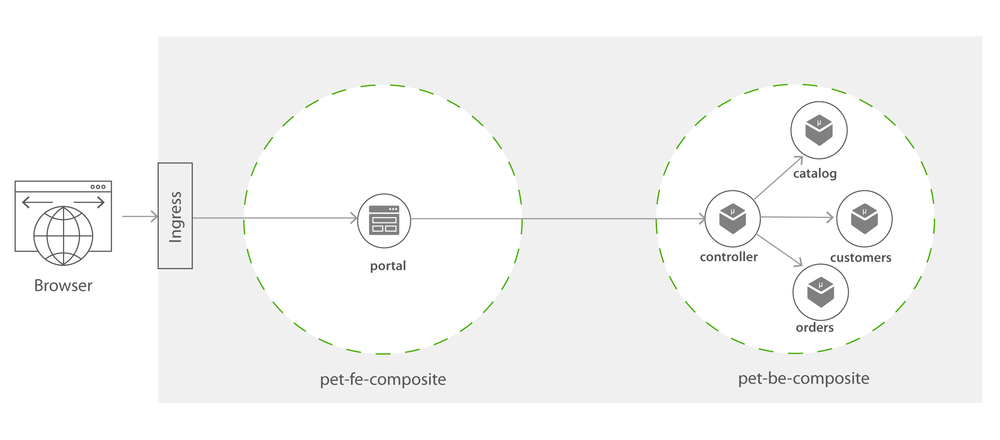
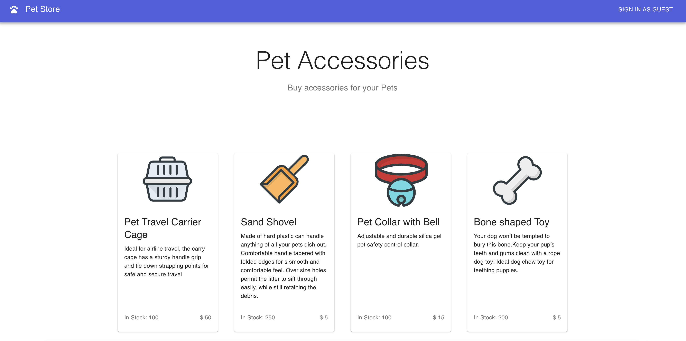

Composite to Composite in Pet-store
=========

This sample demonstrates how the components can be grouped together and installed as simple Composites. 

This sample is a simple webapp which consists of 5 Docker images (4 microservices and a container to serve the web portal). 

* Catalog (Catalog of the accessories available in the pet store)
* Customers (Existing customers of the Pet Store)
* Orders (Orders placed at the Pet Store by Customers)
* Controller (Controller service which fetches data from the above 3 microservices and processes them to provide useful functionality)
* Portal (A simple Node JS container serving a React App with Server Side Rendering)

All 4 micro services are implemented in [node.js](https://nodejs.org/en/) and portal web application is a [React](https://reactjs.org/) application. 

All four backedn components (Catalog, Customers, Orders, and Controller) are included in a backend Composite - [pet-be-guest-mode-composite.bal](pet-be-guest-mode-composite.bal) file, a
and front end component (Portal) is wrapped as another Composite - [pet-fe-guest-mode-composite.bal](pet-fe-guest-mode-composite.bal).

Composites are simply a group of components, and it do not have control over inter-communication between components. Further, unlike cells, 
composites do not have network boundary or cell gateway to control the incoming and traffic cells. 
Therefore, composites will not have default ingress rules or OIDC flow created as we have 
demonstrated in the [pet-store cells](../../cells/pet-store/pet-fe#build-method), which mandates the users to login to 
the pet-store applications. As the OIDC flow is not automatically performed with Composites, we have enabled the guest mode for this 
sample that allows users to by-pass the login flow and let them in as Guest. 

Let us focus on the [pet-fe-guest-mode-composite.bal](pet-fe-guest-mode-composite.bal), which uses composite reference to link to another composite.



```ballerina
import celleryio/cellery;

public function build(cellery:ImageName iName) returns error? {
    string isGuestMode = "true";

    cellery:Component portalComponent = {
            name: "portal",
            source: {
                image: "wso2cellery/samples-pet-store-portal:latest"
            },
            ingresses: {
                portal: <cellery:HttpPortIngress>{
                    port: 80
              }
            },
            envVars: {
                PET_STORE_CELL_URL: { value: ""},
                PORTAL_PORT: { value: 80 },
                BASE_PATH: { value: "." },
                GUEST_MODE_ENABLED: {value: isGuestMode}

            },
            dependencies: {
                composites: {
                    petStoreBackend: <cellery:ImageName>{ org: "wso2cellery", name: "pet-be-guest-mode-composite", ver: "latest" }
                }
        }
    };

    // Assign the URL of the backend cell
   cellery:Reference petStoreBackend = cellery:getReference(portalComponent, "petStoreBackend");
   portalComponent.envVars.PET_STORE_CELL_URL.value =
        "http://" +<string>petStoreBackend.controller_host + ":" + <string>petStoreBackend.controller_port;


    // Composite Initialization
    cellery:Composite petstore = {
        components: {
            portal: portalComponent
        }
    };

    return <@untainted> cellery:createImage(petstore,  iName);
}

public function run(cellery:ImageName iName, map<cellery:ImageName> instances, boolean startDependencies, boolean shareDependencies)
       returns (cellery:InstanceState[]|error?) {
    cellery:Composite petFE = check cellery:constructImage( iName);
    return <@untainted> cellery:createInstance(petFE, iName, instances, startDependencies, shareDependencies);
}
```

Some important points to be noted in the above Composite,
- Dependencies section includes `wso2cellery/pet-be-guest-mode-composite` composite image.
- The actual endpoint of the composite is resolved via loading the cellery:Reference of the `petStoreBackend` dependency alias.

Now let us quick run or build and run the composites. And also observe the composites. 

1. [Quick Run](#quick-run)
2. [Create Ingress](#create-ingress)
3. [Access pet-store Composite](#access-the-pet-store-web-application)
4. [Build and Run the Composite](#build-and-run-the-composite)
5. [Observe the Composite](#observability)

## Quick Run
1. Execute below command to pull the image from [Cellery Hub](https://hub.cellery.io/) and run. If you want to build and run the composite in your own, 
please go [here](#build-and-run-the-composite).

```
$ cellery run wso2cellery/pet-fe-guest-mode-composite:latest -n pet-fe-guest -l petStoreBackend:pet-be-guest -d
```
Now [create the ingress](#create-ingress) to access the pet-store application. 

## Create Ingress
1. You need to create the ingress to allow the external traffic to the pet-store application by below command. 
Please note [this](https://raw.githubusercontent.com/wso2-cellery/samples/master/composites/pet-store/composite-to-composite/pet-store-guest-ingress.yaml) 
ingress is created to direct the traffic to kubernetes service `pet-fe-guest--portal-service` and this name is depends on the instance name of the composite (as we have started the composite instance as `pet-fe-guest`, 
the service name will be `pet-fe-guest--portal-service`). Therefore, in case if you have started the composite instance with different name (e.g. `my-pet-fe-guest`), you will have to modify the ingress service name, 
and create it accordingly (e.g. `my-pet-fe-guest--portal-service`).
```
 $ kubectl apply -f https://raw.githubusercontent.com/wso2-cellery/samples/master/composites/pet-store/composite-to-composite/pet-store-guest-ingress.yaml
```
2. Check the ingress rules are correctly applied by getting the list of ingresses as shown below.
```
  $ kubectl get ingress 
  NAME                      HOSTS                       ADDRESS     PORTS   AGE
  pet-store-guest-ingress   pet-store-guest.com         localhost   80      47s
```
3. Add the IP address shown in the ingress to your /etc/hosts, therefore you can invoke the service. 
```
   127.0.0.1 pet-store-guest.com
```

Now you are all set, you can try to [access the pet-store application](#access-the-pet-store-web-application).

## Access the Pet-store web application
1. Go to [http://pet-store-guest.com/](http://pet-store-guest.com/) and view the application.


2. Sign-in As Guest and try out the application by purchasing some pet accessories. 

## Build and Run the Composite
You can perform a [Quick Run](#quick-run) or build and run the pet-store composite in your own. Please perform below operations to be build your composite.

1. Clone the [wso2-cellery/samples](https://github.com/wso2-cellery/samples) repository.
2. Navigate to the pet-store composite sample.
   ```
   cd <SAMPLES_ROOT>/composites/pet-store/composite-to-composite
   ```
1. Build the cell image for pet-store project by executing the `cellery build` command as shown below. Note `CELLERY_HUB_ORG` is your organization name in [Cellery hub](https://hub.cellery.io/).
    ```
    $ cellery build pet-be-guest-mode-composite.bal <CELLERY_HUB_ORG>/pet-be-guest-mode-composite:latest
    Hello World Cell Built successfully.
    
    ✔ Building image <CELLERY_HUB_ORG>/pet-be-guest-mode-composite:latest
    ✔ Saving new Image to the Local Repository
    
    
    ✔ Successfully built cell image: <CELLERY_HUB_ORG>/pet-be-guest-mode-composite:latest
    
    What's next?
    --------------------------------------------------------
    Execute the following command to run the image:
      $ cellery run <CELLERY_HUB_ORG>/pet-be-guest-mode-composite:latest
    --------------------------------------------------------

    $ cellery build pet-fe-guest-mode-composite.bal <CELLERY_HUB_ORG>/pet-fe-guest-mode-composite:latest
    Hello World Cell Built successfully.
    
    ✔ Building image <CELLERY_HUB_ORG>/pet-fe-guest-mode-composite:latest
    ✔ Saving new Image to the Local Repository
    
    
    ✔ Successfully built cell image: <CELLERY_HUB_ORG>/pet-fe-guest-mode-composite:latest
    
    What's next?
    --------------------------------------------------------
    Execute the following command to run the image:
      $ cellery run <CELLERY_HUB_ORG>/pet-fe-guest-mode-composite:latest
    --------------------------------------------------------
    
    ```

2. Once the pet-store is built, you can run the composite and create the `pet-fe-guest` instance by below command. 
```
$ cellery run wso2cellery/pet-fe-guest-mode-composite:latest -n pet-fe-guest -l petStoreBackend:pet-be-guest -d
  ✔ Extracting Cell Image wso2cellery/pet-fe-guest-mode-composite:latest
  ✔ Reading Image wso2cellery/pet-fe-guest-mode-composite:latest
  ✔ Parsing dependency links
  Info: Main Instance: pet-fe-guest
  Info: Validating dependencies
  Info: Instances to be Used
  ------------------------------------------------------------------------------------------------------------------------
  INSTANCE NAME                  CELL IMAGE                          USED INSTANCE             KIND            SHARED
  ------------------------------------------------------------------------------------------------------------------------
  pet-be-guest                   wso2cellery/pet-be-guest-mode-composite:latest To be Created             Composite       -
  pet-fe-guest                   wso2cellery/pet-fe-guest-mode-composite:latest To be Created             Composite       -
  ------------------------------------------------------------------------------------------------------------------------
  Info: Dependency Tree to be Used
  
  pet-fe-guest
  └── petStoreBackend:pet-be-guest
  
  Info: starting instance pet-be-guest
  ✔ Starting main instance pet-fe-guest
  
  
  ✔ Successfully deployed cell image: wso2cellery/pet-fe-guest-mode-composite:latest
  
  What's next?
  --------------------------------------------------------
  Execute the following command to list running cells:
    $ cellery list instances
  --------------------------------------------------------
   
```
    
3. Now pet-store is deployed, execute `cellery list instances` to see the status of the deployed composite instance.
```
 $ cellery list instances
 
 Composite Instances:
    INSTANCE                         IMAGE                        STATUS   COMPONENTS           AGE
 -------------- ------------------------------------------------ -------- ------------ ---------------------
  pet-be-guest   wso2cellery/pet-be-guest-mode-composite:latest   Ready    4            1 minutes 8 seconds
  pet-fe-guest   wso2cellery/pet-fe-guest-mode-composite:latest   Ready    1            1 minutes
  
```
    
4. Execute `cellery view` to see the components of the composite. This will open a webpage in a browser that allows to visualize the components of the composite image.
    ```
    $ cellery view <CELLERY_HUB_ORG>/pet-fe-guest-mode-composite:latest
    ```
    

Now proceed to [Create Ingress](#create-ingress) to allow the access to the pet-store application, and then [access the application](#access-the-pet-store-web-application).

## Observability
Similar to Cells, the Composites can also be observed. You can login to the [Cellery Dashboard](http://cellery-dashboard) to see the observability.
Please follow the instructions provided [here](../all-in-one-composite#observability) to visualize the observability data. 

# Did you try?
- [Composite to Composite pet-store](../composite-to-composite) - This will demonstrate how we can split the all-in-one composite into two composites and deploy into the runtime.

# What's Next?
- [Cell to Composite pet-store](../cell-to-composite) - This will demonstrate how cells and composites can be deployed together and interacted in a runtime.
- [Pet-store Cell Sample](../../../cells/pet-store/README.md) - This will demonstrate how pet-store application can be easily deployed as cells.
