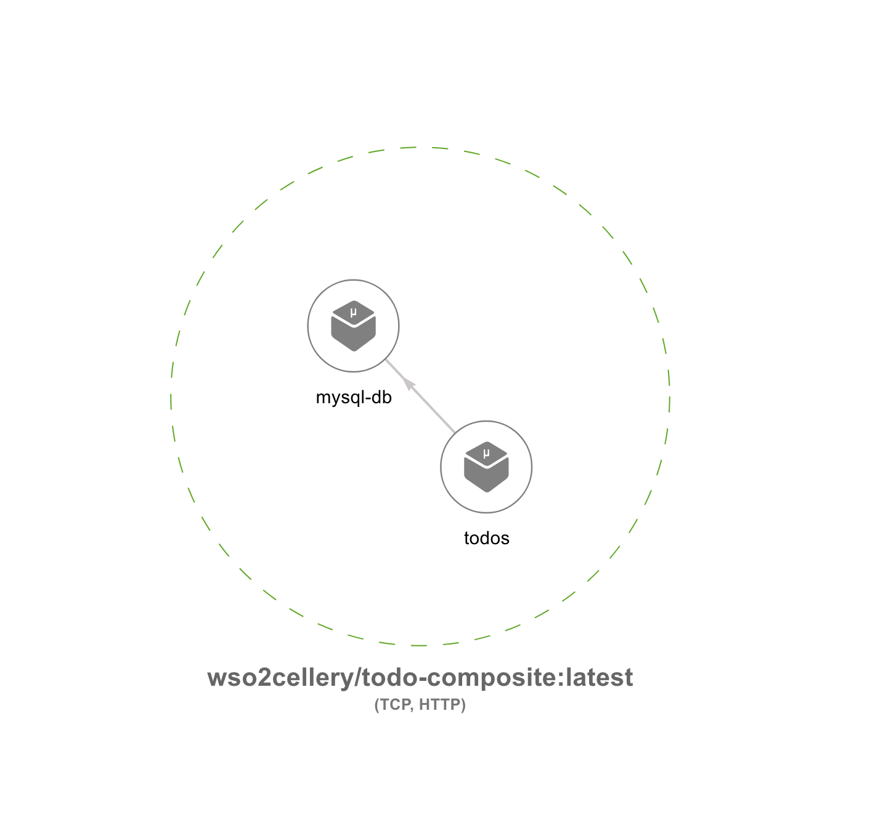
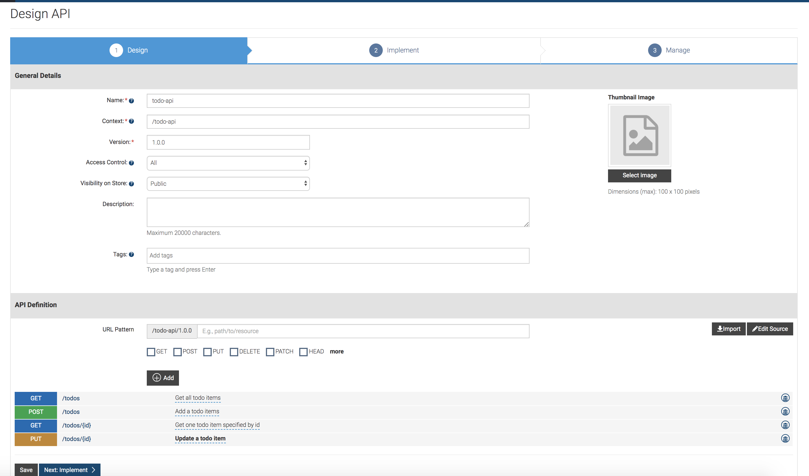
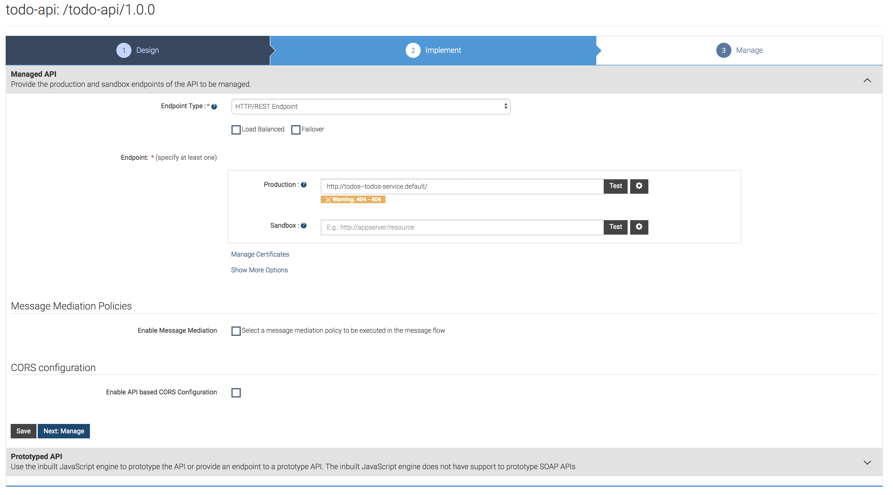
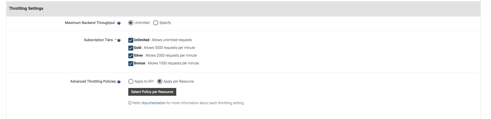
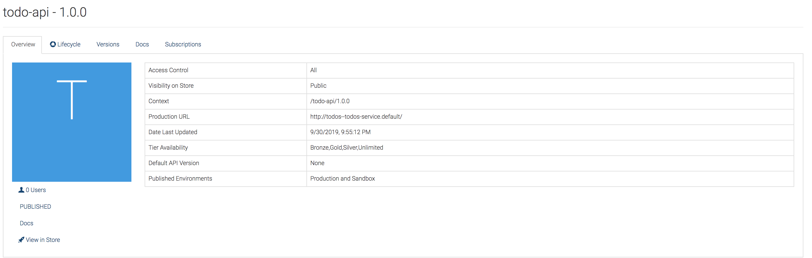
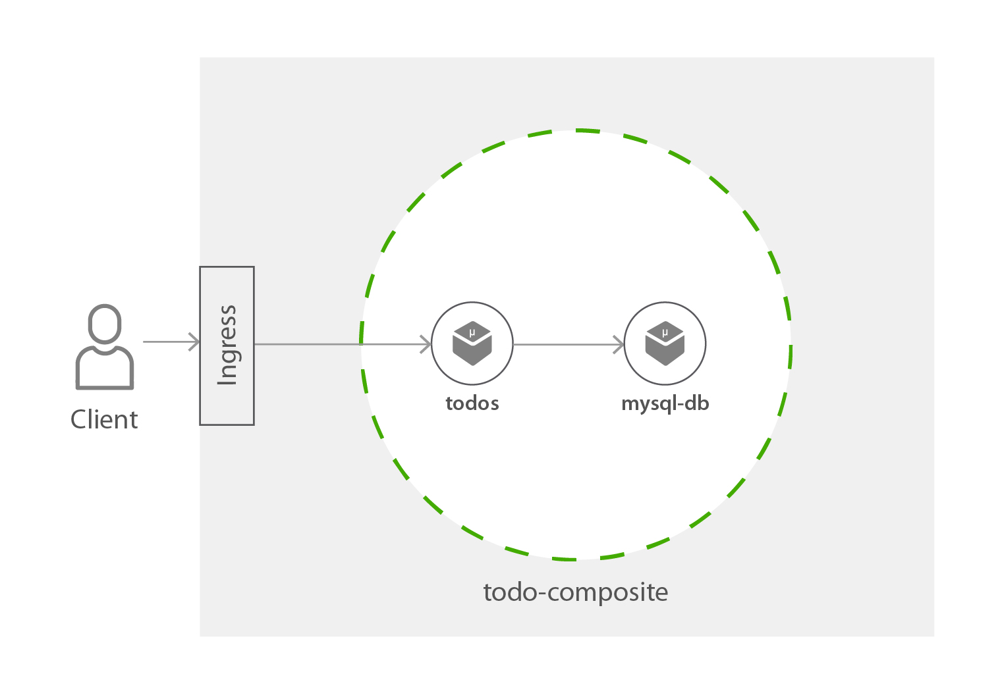
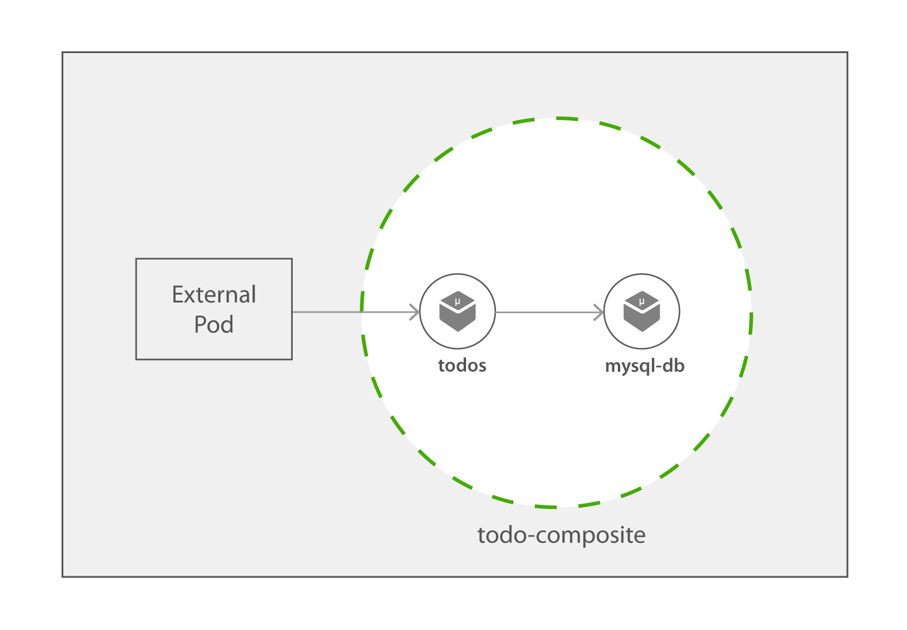

TODO-Service Composite
=========

The TODO composite consists of a simple 'todo' micro service and mysql server. Todo micro service is written in go, and  this service
receives requests to add/list/update todo items. These todo items are stored in mysql database.



Now let's look at the steps required to try this todo-composite.

## Try todo composite

### 1. Checkout the Sample

1. Clone the [wso2-cellery/samples](https://github.com/wso2-cellery/samples) repository
2. Navigate to the todo-service Sample.
   ```
   cd <SAMPLES_ROOT>/composites/todo-service
   ```

### 2. Build and run composite
In this section let us focus on build and run a [todo composite](todo-composite.bal). 

The `todo composite` contains two components `todo` and `mysql`. The `todo` component is defined by a container image `docker.io/wso2cellery/samples-todoapp-todos:latest` 
which is written in Go Lang and it is a simple micro service that add/list/update todo items by connecting to database. The `mysql` component is a MySQL database that is used to 
persists the todo items received by the `todo` component.

```ballerina
import celleryio/cellery;

public function build(cellery:ImageName iName) returns error? {
    int mysqlPort = 3306;
    string mysqlPassword = "root";

    //Mysql database service which stores the todos that were added via the todos service
    cellery:Component mysqlComponent = {
            name: "mysql-db",
            src: {
                image: "docker.io/wso2cellery/samples-todoapp-mysql:latest"
            },
            ingresses: {
                orders:  <cellery:TCPIngress>{
                    backendPort: mysqlPort
                }
            },
            envVars: {
                MYSQL_ROOT_PASSWORD: {value: "root"}
            }
     };

    //This is the todos service which receieves the todo requests and connects
    // to database to persists the information.
    cellery:Component todoServiceComponent = {
        name: "todos",
        src: {
            image: "docker.io/wso2cellery/samples-todoapp-todos:latest"
        },
        ingresses: {
            todo:  <cellery:HttpPortIngress>{
                port: 8080
            }
        },
        envVars: {
            PORT: {value: "8080"},
            DATABASE_HOST: {value:  cellery:getHost(mysqlComponent)},
            DATABASE_PORT : {value: mysqlPort},
            DATABASE_USERNAME: {value: "root"},
            DATABASE_PASSWORD: {value: mysqlPassword},
            DATABASE_NAME: {value: "todos_db"}
        },
        dependencies: {
            components: [mysqlComponent]
         }
    };

    // Composite Initialization
    cellery:Composite composite = {
        components: {
            mysql: mysqlComponent,
            todoService: todoServiceComponent
        }
    };
    return <@untainted> cellery:createImage(composite,  iName);
}

public function run(cellery:ImageName iName, map<cellery:ImageName> instances, boolean startDependencies, boolean shareDependencies)
       returns (cellery:InstanceState[]|error?) {
    cellery:Composite composite = check cellery:constructImage( iName);
    return <@untainted> cellery:createInstance(composite, iName, instances, startDependencies, shareDependencies);
}
```
---

Follow below instructions to build and run the `todo` composite.

1. Build the cell image for todo-composite project by executing the `cellery build` command as shown below. Note `CELLERY_HUB_ORG` is your organization name in [cellery hub](https://hub.cellery.io/).
    ```
    $ cellery build todo-composite.bal <CELLERY_HUB_ORG>/todo-composite:latest
    Hello World Cell Built successfully.
    
    ✔ Building image <CELLERY_HUB_ORG>/todo-composite:latest
    ✔ Saving new Image to the Local Repository
    
    
    ✔ Successfully built cell image: <CELLERY_HUB_ORG>/todo-composite:latest
    
    What's next?
    --------------------------------------------------------
    Execute the following command to run the image:
      $ cellery run <CELLERY_HUB_ORG>/todo-composite:latest
    --------------------------------------------------------
    ```

2. Once the todo-composite is built, you can run the composite and create the `todos` instance by below command. 
    ```
    $ cellery run wso2cellery/todo-composite:latest -n todos
       ✔ Extracting Cell Image wso2cellery/todo-composite:latest
       ✔ Reading Image wso2cellery/todo-composite:latest
       Info: Main Instance: todos
       Info: Validating dependencies
       Info: Instances to be Used
       ------------------------------------------------------------------------------------------------------------------------
       INSTANCE NAME                  CELL IMAGE                          USED INSTANCE             KIND            SHARED
       ------------------------------------------------------------------------------------------------------------------------
       todos                          wso2cellery/todo-composite:latest   To be Created             Composite       -
       ------------------------------------------------------------------------------------------------------------------------
       Info: Dependency Tree to be Used
       
       No Dependencies
       ✔ Starting main instance todos
       
       
       ✔ Successfully deployed cell image: wso2cellery/todo-composite:latest
       
       What's next?
       --------------------------------------------------------
       Execute the following command to list running cells:
         $ cellery list instances
       --------------------------------------------------------
    ```
    
3. Now todo-composite is deployed, execute `cellery list instances` to see the status of the deployed composite instance.
    ```
    $ cellery list instances
    
        Composite Instances:
         INSTANCE                 IMAGE                 STATUS   COMPONENTS           AGE
        ---------- ----------------------------------- -------- ------------ ----------------------
         todos      wso2cellery/todo-composite:latest   Ready    2            1 minutes 40 seconds
    ```
    
4. Execute `cellery view` to see the components of the composite. This will open a webpage in a browser that allows to visualize the components of the composite image.
    ```
    $ cellery view <CELLERY_HUB_ORG>/todo-composite:latest
    ```
    
    
### 3. Invoke the composite application

The todo-composite application can be invoked in several methods as below. Unlike cells, the composites will not have  
network boundary and cell gateway. Therefore, inorder to allow the external traffic inside the kubernetes cluster, you need to follow 
either of below approaches. First two approaches allows the external traffic inside kubernetes cluster, and the third approach 
allows you to invoke the service from a container within the kuberrnetes cluster. 


1. [Invoke via API defined in Global APIM](#31-invoke-via-api-defined-in-global-apim)
2. [Invoke by creating an ingress](#32-invoke-by-creating-an-ingress)
3. [Invoke by creating debug pod](#33-invoke-by-creating-debug-pod)

#### 3.1. Invoke via API defined in Global APIM


In this approach, user will have to create and publish an API in the global APIM, and then subscribe to that API inorder to invoke it as shown above diagram.

Execute below steps to create and publish `todo-api` in Global APIM.

1. Login to [Global APIM](https://wso2-apim/publisher/) with username: admin and password admin.
2. Click on `Create New`, and `Design a New REST API`. And Design the API as shown below, and click `Save and Implement`.

3. Implement the API as shown below, and click on `Save and Manage`.

4. Manage the API as shown below and finally click `Save and Publish`. 

5. You can now see the published API in the API listing view of the /publisher.


Execute below steps to subscribe to the API and invoke it.

1. Login to the [API Store](https://wso2-apim/store/) as admin user (username: admin, password: admin).
    
2. Click on ‘todo-api’ to create a subscription and generate a token. 
(See  [Subscribing to an API](https://docs.wso2.com/display/AM260/Subscribe+to+an+API))
       
3. Once you have subscribed to the API and generated a token, invoke the API passing the same as a Bearer token.
   ```
   // Get the list of todo items
   $ curl https://wso2-apim-gateway/todo-api/1.0.0/todos -k  -H "Authorization: Bearer <token>"
   [
     {
       "id": 1,
       "title": "Walk",
       "content": "Walk for 30 min around 6 PM",
       "done": false
     },
     {
       "id": 2,
       "title": "Pay Bills",
       "content": "Pay electricity and water bills",
       "done": false
     }
   ]
   
   // Add a new todo item
   $ curl -X POST https://wso2-apim-gateway/todo-api/1.0.0/todos -H "Authorization: Bearer <token>" -k -d '{"title":"Coursework submission","content":"Submit the course work at 9:00p.m","done":false}'
   {
     "message": "successfully created"
   }
   
   // Get a todo item details
   $ curl https://wso2-apim-gateway/todo-api/1.0.0/todos/3 -k  -H "Authorization: Bearer <token>"
     {
       "id": 3,
       "title": "Coursework submission",
       "content": "Submit the course work at 9:00p.m",
       "done": false
     }
     
   // Update a todo item
   $ curl -X PUT https://wso2-apim-gateway/todo-api/1.0.0/todos/3 -H "Authorization: Bearer <token>" -k -d '{"title":"Submission","content":"Submit the course work at 9:00p.m","done":true}'
   {
     "message": "successfully updated"
   }
   ```
Now you can push the cell image to [Cellery Hub](https://hub.cellery.io/) as explained in [step-4](#4-push-your-composite).

#### 3.2. Invoke by creating an ingress
 

As shown below, an ingress can be created to allow the external traffic into the todo-composite. Note, this method do not have any security checks as the first method, and 
hence it simply opens up the service to external access.

Execute below steps to create ingress and invoke the application.

1. Execute below command to create an ingress. Please note [this](https://raw.githubusercontent.com/wso2-cellery/samples/master/composites/todo-service/todo-service-ingress.yaml) 
ingress is created to direct the traffic to kubernetes service `todos--todos-service` and this name is depends on the instance name of the composite (as we have started the composite instance as `todos`, 
the service name will be `todos--todos-service`). Therefore, in case if you have started the composite instance with different name (e.g. `my-todos`), you will have to modify the ingress service name, 
and create it accordingly (e.g. `my-todos--todos-service`).

    ```
    $ kubectl apply -f https://raw.githubusercontent.com/wso2-cellery/samples/master/composites/todo-service/todo-service-ingress.yaml
    ```
    
2. Check the ingress rules are correctly applied by getting the list of ingresses as shown below.
    ```
    kubectl get ingress 
    NAME                   HOSTS              ADDRESS     PORTS   AGE
    todo-service-ingress   todo-service.com   localhost   80      25m
    ```

3. Add the IP address shown in the ingress to your /etc/hosts, therefore you can invoke the service. 
    ```
    127.0.0.1 todo-service.com
    ```
    
4. Invoke by todo-service by following `curl` commands.

   ```
      // Get the list of todo items
      $ curl http://todo-service.com/todos -k  
      [
        {
          "id": 1,
          "title": "Walk",
          "content": "Walk for 30 min around 6 PM",
          "done": false
        },
        {
          "id": 2,
          "title": "Pay Bills",
          "content": "Pay electricity and water bills",
          "done": false
        }
      ]
      
      // Add a new todo item
      $ curl -X POST http://todo-service.com/todos -k -d '{"title":"Coursework submission","content":"Submit the course work at 9:00p.m","done":false}'
      {
        "message": "successfully created"
      }
      
      // Get a todo item details
      $ curl http://todo-service.com/todos/3 -k 
        {
          "id": 3,
          "title": "Coursework submission",
          "content": "Submit the course work at 9:00p.m",
          "done": false
        }
        
      // Update a todo item
      $ curl -X PUT http://todo-service.com/todos/3 -k -d '{"title":"Submission","content":"Submit the course work at 9:00p.m","done":true}'
      {
        "message": "successfully updated"
      }
      ```
 
Now you can push the cell image to [Cellery Hub](https://hub.cellery.io/) as explained in [step-4](#4-push-your-composite).

#### 3.3. Invoke by creating debug pod


This approach is different from the above mentioned two approaches, where this does not allow the external traffic inside the cluster, 
rather creates a debug pod inside the kubernetes cluster that allows you to invoke the services.

Execute below steps to invoke the service from debug pod.

1) Create a debug pod into the cluster by below command.
    ```
    $ kubectl run debug-tools --image=mirage20/k8s-debug-tools --restart=Never
    $ kubectl get pods
    NAME                                          READY   STATUS    RESTARTS   AGE
    debug-tools                                   2/2     Running   0          15m
    ``` 
    
2) Now exec into the debug pods with following command, and directly invoke the todo-service.
    ```
    $ kubectl exec -it debug-tools bash
    Defaulting container name to debug-tools.
    Use 'kubectl describe pod/debug-tools -n default' to see all of the containers in this pod.
    root@debug-tools:/# curl -k http://todos--todos-service/todos
    [
      {
        "id": 1,
        "title": "Walk",
        "content": "Walk for 30 min around 6 PM",
        "done": false
      },
      {
        "id": 2,
        "title": "Pay Bills",
        "content": "Pay electricity and water bills",
        "done": false
      }
    ]
    root@debug-tools:/# curl -X POST http://todos--todos-service/todos -k -d '{"title":"Coursework submission","content":"Submit the course work at 9:00p.m","done":false}'
    {
     "message": "successfully created"
    }
    
    root@debug-tools:/# curl http://todos--todos-service/todos/3 -k 
     {
       "id": 3,
       "title": "Coursework submission",
       "content": "Submit the course work at 9:00p.m",
       "done": false
     }
     
    root@debug-tools:/# curl -X PUT http://todos--todos-service/todos/3 -k -d '{"title":"Submission","content":"Submit the course work at 9:00p.m","done":true}'
     {
       "message": "successfully updated"
     }
    ```
    
Now you can push the cell image to [Cellery Hub](https://hub.cellery.io/) as explained in [step-4](#4-push-your-composite).

### 4. Push your composite  
1. As a final step, let's push your todo-composite [cellery hub](https://hub.cellery.io/) account as shown below.
    ```
    $ cellery push <CELLERY_HUB_ORG>/todo-composite:latest
    ✔ Connecting to registry-1.docker.io
    ✔ Reading image <CELLERY_HUB_ORG>/todo-composite:latest from the Local Repository
    ✔ Checking if the image <CELLERY_HUB_ORG>/todo-composite:latest already exists in the Registry
    ✔ Pushing image <CELLERY_HUB_ORG>/todo-composite:latest
    
    Image Digest : sha256:8935b3495a6c1cbc466ac28f4120c3836894e8ea1563fb5da7ecbd17e4b80df5
    
    ✔ Successfully pushed cell image: <CELLERY_HUB_ORG>/todo-composite:latest
    
    What's next?
    --------------------------------------------------------
    Execute the following command to pull the image:
      $ cellery pull <CELLERY_HUB_ORG>/todo-composite:latest
    --------------------------------------------------------
    ```
Congratulations! You have successfully created your own composite!
 

## What's Next? 
1. [Try hello world cell](../../cells/hello-world)
2. [Try hello world Api cell](../../cells/hello-world-api)
