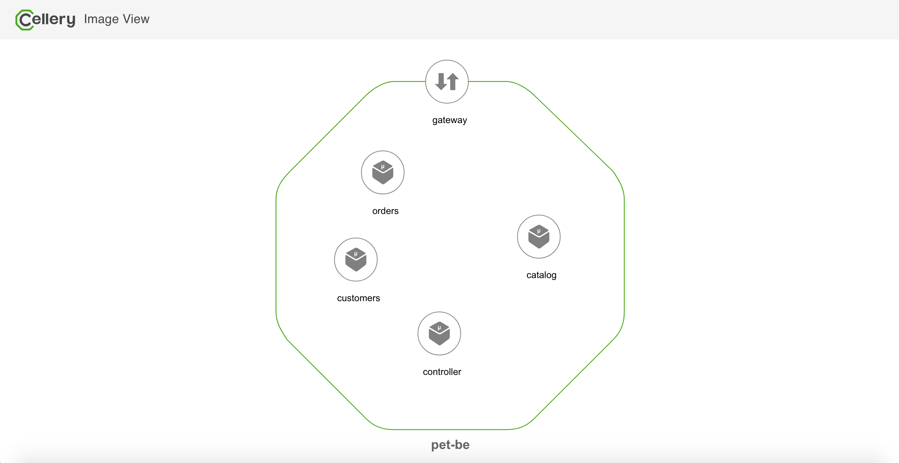
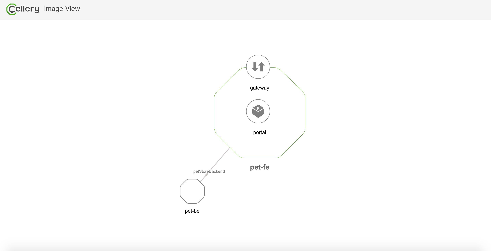

# Build and run pet store application

This readme explains the steps to build and run the pet-store cells by your own. Follow the instruction given below to,

1. [Checkout sample](#1-checkout-the-sample)
2. [Build pet-be cell](#2-build-pet-be-cell)
3. [Build and run pet-fe cell](#3-build-and-run-pet-fe-cell)
4. [View the pet-store application](#4-view-the-pet-store-application)

### 1. Checkout the Sample

1. Clone the [wso2/cellery-samples](https://github.com/wso2/cellery-samples) repository
2. Navigate to the pet-store Sample.
   ```
   cd <SAMPLES_ROOT>/cells/pet-store
   ```

### 2. Build pet-be cell
1.  Build the pet-be cell by executing `cellery build` command as shown below. 
   ```
   $ cellery build pet-be/ wso2cellery/pet-be-cell:0.6.0
   Warning: Value is empty for environment variable "ORDER_HOST"
   Warning: Value is empty for environment variable "CATALOG_HOST"
   Warning: Value is empty for environment variable "CUSTOMER_HOST"
   true
   ✔ Building image wso2cellery/pet-be-cell:0.6.0
   ✔ Removing old Image
   ✔ Saving new Image to the Local Repository
   
   
   ✔ Successfully built cell image: wso2cellery/pet-be-cell:0.6.0
   
   What's next?
   --------------------------------------------------------
   Execute the following command to run the image:
     $ cellery run wso2cellery/pet-be-cell:0.6.0
   --------------------------------------------------------
   ```
2. View the cell information by executing `cellery view` command. This will open up a new tab in the browser and shows 
the component and dependency details of the cell. 
    ```
    $ cellery view wso2cellery/pet-be-cell:0.6.0
    ```
    

3. Execute `cellery list ingress` to see the list ingress supported by the pet-be cell, and you can see only `controller` component is exposing the API. 
    ```
    $ cellery list ingress wso2cellery/pet-be-cell:0.6.0
      COMPONENT    INGRESS TYPE   INGRESS CONTEXT   INGRESS PORT   GLOBALLY EXPOSED
     ------------ -------------- ----------------- -------------- ------------------
      controller   HTTP           controller        80             False
    ```
    
### 3. Build and run pet-fe cell
1. Build the pet-fe cell by executing the `cellery build` command.
   ```
   $ cd pet-fe
   $ cellery build pet-fe.bal wso2cellery/pet-fe-cell:0.6.0
   Warning: Value is empty for environment variable "PET_STORE_CELL_URL"
   true
   ✔ Building image wso2cellery/pet-fe-cell:0.6.0
   ✔ Removing old Image
   ✔ Saving new Image to the Local Repository
   
   
   ✔ Successfully built cell image: wso2cellery/pet-fe-cell:0.6.0
   
   What's next?
   --------------------------------------------------------
   Execute the following command to run the image:
     $ cellery run wso2cellery/pet-fe-cell:0.6.0
   --------------------------------------------------------
   ```
2. View the inner components and cell dependency of cell wso2cellery/pet-fe-cell:0.6.0.
    ```
    $ cellery view wso2cellery/pet-fe-cell:0.6.0
    ```
    

3. Run the pet-fe cell with instance name `pet-fe`, and provide the dependent pet-be cell instance as `pet-be`. 
As we haven't started the pet-be cell instance, we'll pass `-d` or `--start-dependencies` flag with run command to 
start dependent cell instance if it is not available in the runtime.
   ```
   $ cellery run wso2cellery/pet-fe-cell:0.6.0 -n pet-fe -l petStoreBackend:pet-be -d
   ✔ Extracting Cell Image wso2cellery/pet-fe-cell:0.6.0
   
   Main Instance: pet-fe
   
   ✔ Reading Cell Image wso2cellery/pet-fe-cell:0.6.0
   ✔ Validating dependency links
   ✔ Generating dependency tree
   ✔ Validating dependency tree
   
   Instances to be Used:
   
     INSTANCE NAME          CELL IMAGE               USED INSTANCE   SHARED
    --------------- ------------------------------- --------------- --------
     pet-be          wso2cellery/pet-be-cell:0.6.0   To be Created    -
     pet-fe          wso2cellery/pet-fe-cell:0.6.0   To be Created    -
   
   Dependency Tree to be Used:
   
    pet-fe
      └── petStoreBackend: pet-be
   
   ? Do you wish to continue with starting above Cell instances (Y/n)?
   
   ✔ Starting instance pet-be
   ✔ Starting dependencies
   ✔ Starting main instance pet-fe
   
   
   ✔ Successfully deployed cell image: wso2cellery/pet-fe-cell:0.6.0
   
   What's next?
   --------------------------------------------------------
   Execute the following command to list running cells:
     $ cellery list instances
   --------------------------------------------------------
   ```
3. Optionally check the status of the running cell pet-fe.
   ```
   $ cellery status pet-fe
           CREATED         STATUS
    --------------------- --------
     5 minutes 3 seconds   Ready
   
   
     -COMPONENTS-
   
      NAME               STATUS
    --------- -----------------------------
     gateway   Up for 4 minutes 52 seconds
     portal    Up for 4 minutes 49 seconds
     sts       Up for 4 minutes 55 seconds
   ```

### 4. View the pet-store application 

As both pet-fe and pet-be cells are up and running, now you can view the actual pet-store application by following the 
instructions [here](../../cells/pet-store/README.md#view-application)


## What's Next?
- [Cell Test](test-be-cell.md) - perform pet-be cell test and shows the results in the log file.
- [Observe the pet-store](observability.md) - this shows how you can observe and understand the runtime operations to the pet-store application.
- [Update pet-be cell](component-patch-and-adv-deployment.md#cell-component-update) - provides the steps to update the components of the pet-be cell.
- [Advanced deployments with pet-be cell](component-patch-and-adv-deployment.md#blue-green-and-canary-deployment) - perform advanced deployments with pet-be cell.
- [Scale pet-be cell](scale-cell.md) - walks through the steps to scale pet-be cell with horizontal pod autoscaler, and zero scaling with Knative. 
- [Pet store sample](../../cells/pet-store/README.md) - provides the instructions to work with pet-store sample.
