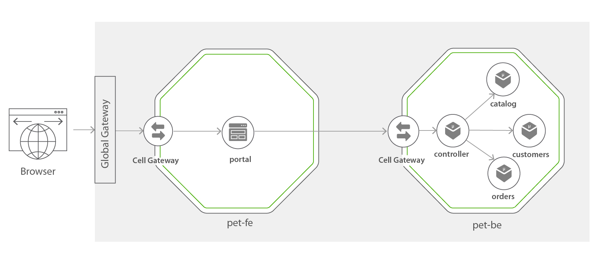

Pet Store
=========

Pet Store is a Web Portal which can be used by the Customers for Ordering Accessories for their Pets.

This Sample is a simple Web App which consists of 5 Docker images (4 microservices and a container to serve the Web Portal).

* Catalog (Catalog of the accessories available in the Pet Store)
* Customers (Existing customers of the Pet Store)
* Orders (Orders placed at the Pet Store by Customers)
* Controller (Controller service which fetches data from the above 3 microservices and processes them to provide useful functionality)
* Portal (A simple Node JS container serving a React App with Server Side Rendering)

This sample is structured into two Cells.

* [pet-be Cell](#pet-be-cell)
* [pet-fe Cell](#pet-fe-cell)



## pet-be Cell

This contains the four components which involves with working with the Pet Store data and also the business logic. This Cell has an HTTP Ingress to expose the APIs.

## pet-fe Cell

This contains of a single component which serves the Portal. The Portal is exposed through a Web Cell which is able to provide SSO and Web Content delivery features.

## Getting Started

### Checkout the Sample

1. Clone the [wso2-cellery/samples](https://github.com/wso2-cellery/samples) repository
2. Navigate to the pet-store Sample.
   ```
   cd <SAMPLES_ROOT>/pet-store
   ```

### Running the Backend Cell

1. Build the pet-be Cell.
   ```
   cd <SAMPLES_ROOT>/pet-store/backend
   cellery build pet-be.bal wso2cellery/pet-be:0.1.0
   ```
2. Deploy the pet-be Cell with instance name `pet-be-inst`.
   ```
   cellery run wso2cellery/pet-be:0.1.0 -n pet-be-inst
   ```
3. Check the running Cell.
   ```
   cellery status pet-be-inst
   ```

### Running the Frontend Cell

**Note** : The Web cell is still under development.

1. Build the pet-fe Cell.
   ```
   cd <SAMPLES_ROOT>/pet-store/frontend
   cellery build pet-fe.bal wso2cellery/pet-fe:0.1.0
   ```
2. Deploy the pet-fe Cell with instance name `pet-fe-inst`.
   ```
   cellery run wso2cellery/pet-fe:0.1.0 -n pet-fe-inst -l pet-be:pet-be-inst
   ```
3. Check the running Cell.
   ```
   cellery status pet-fe-inst
   ```

Please feel free to checkout this repository and play around with the sample.

## Building the Components from Source

You do not need to build the Components if you just wish to deploy the Cells. This should only be done if you wish to change the Pet Store sample and play around with it.

### Prerequisites

* Docker
* Node & NPM
* GNU Make 4.1+

### Building the Components

If you wish to change the Pet Store Sample and play around with Cellery, you can follow this section to rebuild the Components.

1. [Checkout](#checkout-the-sample) the Sample
2. Set the following environment variables for customizing the build.

   | Environment Variable  |                                                                       |
   |-----------------------|-----------------------------------------------------------------------|
   | DOCKER_REPO           | The name of the repository of the Docker images (Your Docker Hub ID)  |
   | DOCKER_IMAGE_TAG      | The tag of the Docker images                                          |

3. Run the make target for building docker images.
   ```
   make docker
   ```
   This would build the components from source and build the docker images using the environment variables you have provided.
4. Login to Docker Hub
   ```
   docker login
   ```
5. Run the target for pushing the docker images.
   ```
   make docker-push
   ```
6. Update the `<SAMPLES_ROOT>/pet-store/backend/pet-be.bal` and `<SAMPLES_ROOT>/pet-store/frontend/pet-fe.bal` files and set the newly created image names for the Component source.
7. [Build and run](#getting-started) the Cells.
