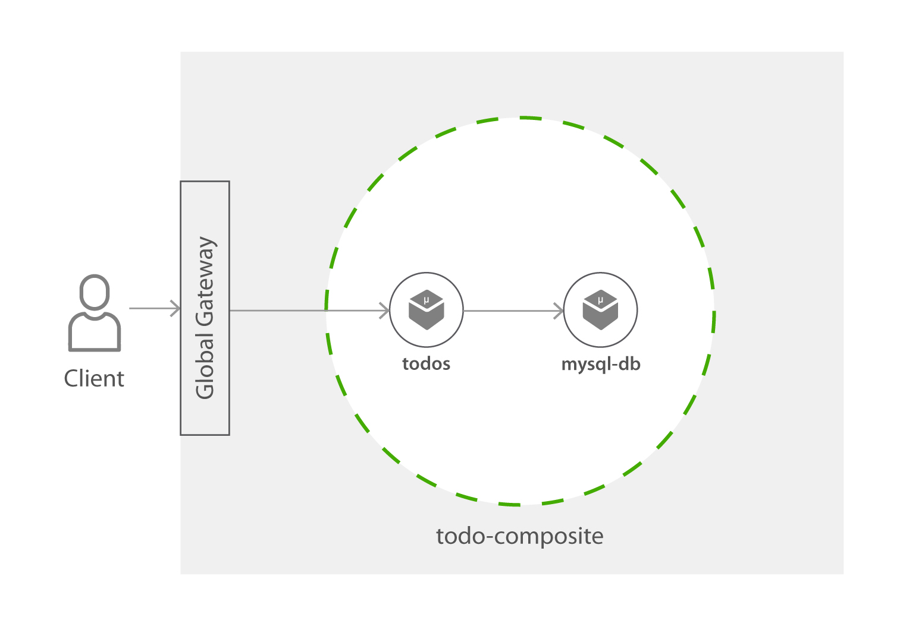

Todo API
=========
Todo API is a simple todo tracking API with mysql database 



## Building from Source

### Prerequisites

* Docker
* Golang 1.12

### Building the Components

If you wish to change the Todo API Sample, you can follow this section to rebuild the Components.

1. Clone the [wso2-cellery/samples](https://github.com/wso2-cellery/samples) repository to your `GO_PATH/src/github.com/wso2cellery` directory. 
2. Set the following environment variables for customizing the build.

   | Environment Variable  |                                                                       |
   |-----------------------|-----------------------------------------------------------------------|
   | DOCKER_REPO           | The name of the repository of the Docker images (Your Docker Hub ID)  |
   | DOCKER_TAG            | The tag of the Docker images                                          |

3. Run the make target for building docker images.
   ```
   make docker
   ```
   This would build the components from source and build the docker images using the environment variables you have provided.
4. Login to Docker Hub
   ```
   docker login
   ```
5. Run the target for pushing the docker images.
   ```
   make docker-push
   ```
6. Update the `<SAMPLES_ROOT>/composites/todo-service/todo-composite.bal` file and set the newly created image names for the component source.

7. [Build and run](../../composites/todo-service#2-build-and-run-composite) the Composite.

## What's Next? 
1. [Hello world](../hello-world)
2. [Try pet store](../pet-store)
